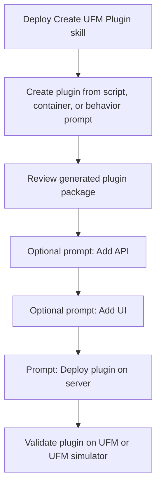

# Create UFM Plugins with AI: A Skill-First Workflow

This version of the blog is about the workflow we want people to repeat, not the
implementation details behind one generated plugin.

The main idea is simple:

1. Deploy the `Create UFM Plugin` skill into the AI agent.
2. Use skill prompts to create or update a UFM plugin.
3. Deploy the generated plugin on UFM, or on the UFM simulator for a fast test.

That is the story for the podcast: AI is useful here because it turns a manual
plugin-development process into a reusable skill.

## What We Are Building

The public `Mellanox/ufm_sdk_3.0` repository now carries a small package under:

```text
ai_ufm_plugin_blog/
```

The package contains:

- A reusable AI-agent skill:

```text
ai_ufm_plugin_blog/skills/create-ufm-plugin-from-script
```

- Example generated plugins:

```text
ai_ufm_plugin_blog/examples/no_ui/ports_snapshot_plugin
ai_ufm_plugin_blog/examples/with_ui/ports_snapshot_plugin
```

- Blog material:

```text
ai_ufm_plugin_blog/blog/
```

The skill is the important artifact. The example plugin is just a proof point
that the prompts produce something deployable.

## Step 1: Deploy the Create UFM Plugin Skill

Start from a checkout of the SDK repository:

```bash
git clone https://github.com/Mellanox/ufm_sdk_3.0.git
cd ufm_sdk_3.0
```

Deploy the skill into the agent runtime. For Codex-style local skills, copy the
skill directory into the agent skills directory:

```bash
export CODEX_HOME="${CODEX_HOME:-$HOME/.codex}"
mkdir -p "$CODEX_HOME/skills"
rsync -a \
  ai_ufm_plugin_blog/skills/create-ufm-plugin-from-script/ \
  "$CODEX_HOME/skills/create-ufm-plugin-from-script/"
```

Then start a fresh agent session from the SDK repository. The fresh session is
important because the agent discovers available skills at session startup.

Use this as a smoke test prompt:

```text
Use the Create UFM Plugin skill.
Create UFM plugin from script scripts/ufm_ports/load_ports.py
```

Expected result: the agent recognizes the skill, inspects the script, and
generates a UFM plugin package instead of giving a generic coding answer.

If the agent runtime is not Codex, register the same `SKILL.md`, `references/`,
and `scripts/` directory as a local agent skill. The contract is the same: the
agent should call the skill when the user asks to create or update a UFM plugin.

## Step 2: Use Skill Prompts to Create or Update the Plugin

The skill should be driven by user prompts. The user should not need to ask for
individual files, Docker layers, Flask routes, UI federation details, or plugin
lifecycle scripts.

The useful prompts are:

| Prompt | What the agent should do |
| --- | --- |
| `Create UFM plugin from script scripts/ufm_ports/load_ports.py` | Create a plugin from an existing SDK script. |
| `Create UFM plugin from container <image_or_dockerfile>` | Wrap an existing container as a UFM-managed plugin. |
| `Create UFM plugin that will scrape UFM events and stream them to fluentd destination <destination> every <T> interval` | Create a new plugin from a behavior description. |
| `Add UI <optional_ui_template>` | Add a UFM UI extension to an existing plugin. |
| `Add API to plugin <api_description>` | Add a plugin API after the base plugin exists. |
| `Deploy plugin on server <ufm_host>` | Build, deploy, enable, and validate the plugin on a target UFM server. |

The high-level flow looks like this:



For the demo plugin, the first prompt can be:

```text
Create UFM plugin from script scripts/ufm_ports/load_ports.py
```

Then update the same plugin with:

```text
Add UI "Ports Snapshot dashboard"
```

Or add another API:

```text
Add API to plugin: return a compact ports health summary with total ports,
active ports, disabled ports, and a five-row sample.
```

For a more operations-focused example:

```text
Create UFM plugin that will scrape UFM events and stream them to fluentd
destination fluentd.lab.example.com:24224 every 30 seconds.
```

The agent should respond with changed files, validation results, and the next
command or prompt to continue.

## Step 3: Deploy the New Plugin on UFM or the UFM Simulator

For development and podcast demos, use the UFM simulator first. The simulator
gives the plugin a realistic UFM API and UI surface without requiring a physical
fabric.

Start or reuse a simulator UFM server, then ask the agent to deploy:

```text
Deploy plugin on server swx-snap3.mtr.labs.nvidia.com.
Use UFM simulator mode and the default topology.
Build the plugin image, deploy it with UFM plugin manager, enable it,
and validate the plugin REST API and UI.
```

The expected agent output should include:

- Plugin image build status.
- Plugin manager deploy/add/enable result.
- UFM plugin status.
- REST validation result.
- UI validation result when UI was requested.

The user-facing validation can stay compact:

```bash
curl -k -u admin:123456 https://<ufm-host>/ufmRest/plugin/<plugin>/healthz
curl -k -u admin:123456 https://<ufm-host>/ufmRest/plugin/<plugin>/summary
```

Then open:

```text
https://<ufm-host>/ufm/
```

If UI was added, the new plugin should appear in the UFM left menu.

## Demo Script for the Podcast

Use this sequence:

1. Show the SDK repository with `ai_ufm_plugin_blog/`.
2. Deploy the `Create UFM Plugin` skill into the agent.
3. Start a fresh agent session.
4. Prompt: `Create UFM plugin from script scripts/ufm_ports/load_ports.py`.
5. Prompt: `Add UI "Ports Snapshot dashboard"`.
6. Prompt: `Deploy plugin on server <ufm-simulator-host>`.
7. Open UFM and show the plugin running.

That keeps the story centered on the AI workflow:

- The user gives intent.
- The skill turns intent into a repeatable engineering process.
- The agent creates or updates the plugin.
- UFM simulator proves the result.

## What This Blog Intentionally Skips

This blog does not walk through the internal plugin code file by file. It does
not explain the backend extraction, UI configuration, lifecycle scripts, or
container packaging in detail.

Those details still exist in the repository for readers who want to inspect
them, but they are not the headline. The headline is the reusable skill:

```text
Create UFM plugin from script XXX
```

That is the prompt we want an AI agent to understand.

## Source Artifacts

- SDK repository: [Mellanox/ufm_sdk_3.0](https://github.com/Mellanox/ufm_sdk_3.0)
- Skill: `ai_ufm_plugin_blog/skills/create-ufm-plugin-from-script`
- Blog demo plugin without UI: `ai_ufm_plugin_blog/examples/no_ui/ports_snapshot_plugin`
- Blog demo plugin with UI: `ai_ufm_plugin_blog/examples/with_ui/ports_snapshot_plugin`
- Initial SDK script: `scripts/ufm_ports/load_ports.py`
