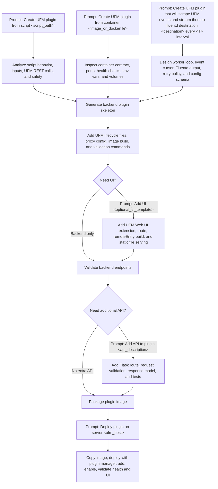

# From UFM SDK Script to UFM Plugin: An AI-Agent Workflow

This post is a technical companion for a podcast segment on using AI to extend NVIDIA UFM. The goal is not to show a giant generated application. The goal is smaller and more useful: start with a simple UFM SDK script, turn it into a backend-only UFM plugin, add a UI extension, and then package the whole process as an agent skill so the next plugin starts with one prompt:

```text
Create UFM plugin from script XXX
```

## Why This Demo

The public [Mellanox/ufm_sdk_3.0](https://github.com/Mellanox/ufm_sdk_3.0) repository is a strong source for this workflow because it contains both script examples and plugin examples. Its README describes the scripts as Python examples for collecting data and operating devices through UFM REST API, and it also includes backend and UI plugin examples.

For the first pass, we chose:

```text
scripts/ufm_ports/load_ports.py
```

Source link: [load_ports.py](https://github.com/Mellanox/ufm_sdk_3.0/blob/main/scripts/ufm_ports/load_ports.py)

This is a good starter script because it is read-only, uses the UFM REST path `resources/ports`, and has simple inputs: `system`, `active`, and `show_disabled`. That makes it safe to demonstrate and easy to convert into HTTP query parameters.

## Prompt-Driven Plugin Flow

The skill should feel like a guided workflow, not a single magic command. The user can start from an existing SDK script, an existing container, or a behavior description. From there, the agent incrementally adds backend logic, APIs, UI, packaging, and deployment.



Prompt guide:

| User prompt | Agent interpretation | Expected output |
| --- | --- | --- |
| `Create UFM plugin from script scripts/ufm_ports/load_ports.py` | Extract script logic into a UFM plugin backend. | `src/logic.py`, Flask app, lifecycle scripts, Docker build, `/run` and `/summary` endpoints. |
| `Create UFM plugin from container <image_or_dockerfile>` | Wrap an existing service as a UFM-managed plugin. | Plugin metadata, proxy config, shared volume mapping, health endpoint, deployment instructions. |
| `Create UFM plugin that will scrape UFM events and stream them to fluentd destination <destination> every <T> interval` | Generate a new plugin from a behavior description. | Polling worker, event cursor/state file, Fluentd client, retry/backoff logic, configurable interval and destination. |
| `Add UI <optional_ui_template>` | Extend the backend plugin with a UFM Web UI entry. | `*_ui_conf.json`, Angular module federation bundle, menu route, UI service calling plugin REST APIs. |
| `Add API to plugin <api_description>` | Add a plugin REST capability after the basic backend exists. | New route, schema/validation, implementation, curl examples, tests. |
| `Deploy plugin on server <ufm_host>` | Move from generated code to a running UFM plugin. | Image copy/load, plugin-manager `deploy`, `add`, `enable`, health checks, UI validation. |

## Stage 1: Extract the Script Logic

The script's core idea is:

1. Build a request to `resources/ports`.
2. Add optional filters such as system and active state.
3. Return the JSON payload from UFM.

The AI agent should not blindly wrap the script's `__main__` block. CLI parsing, file output, and process exits belong in command-line tools, not plugin request handlers. Instead, the agent extracts the useful behavior into a pure module:

```text
examples/no_ui/ports_snapshot_plugin/src/logic.py
```

The generated plugin exposes:

```text
/ufmRest/plugin/ports_snapshot/healthz
/ufmRest/plugin/ports_snapshot/run
/ufmRest/plugin/ports_snapshot/summary
```

The `/summary` endpoint gives the UI something useful to show: total ports, active ports, disabled ports, state counts, and a small sample.

## Stage 2: Build a Backend-Only Plugin

The backend-only plugin is in:

```text
examples/no_ui/ports_snapshot_plugin
```

It follows the UFM SDK plugin pattern from the [hello_world_plugin](https://github.com/Mellanox/ufm_sdk_3.0/tree/main/plugins/hello_world_plugin):

```text
build/Dockerfile
build/docker_build.sh
conf/ports_snapshot_httpd_proxy.conf
conf/supervisord.conf
scripts/init.sh
scripts/deinit.sh
scripts/upgrade.sh
src/app.py
src/logic.py
src/requirements.txt
```

The important UFM-specific file is:

```text
conf/ports_snapshot_httpd_proxy.conf
```

It contains:

```text
port=8925
```

UFM uses that port to proxy authenticated plugin REST traffic. NVIDIA UFM plugin documentation describes plugin deployment through the Web UI or management script after the plugin image is loaded on the UFM server: [UFM Plugins](https://docs.nvidia.com/networking/display/ufmenterpriseumv6231/ufm-plugins).

Build flow:

```bash
cd ai_ufm_plugin_blog/examples/no_ui/ports_snapshot_plugin
bash build/docker_build.sh
docker load -i build/ufm-plugin-ports_snapshot_latest-docker.img.gz
```

This is already a useful plugin. It has no UI yet, which is the right first checkpoint: validate the backend before making UFM Web UI load a remote module.

## Stage 3: Add a UFM UI Extension

The UI-enabled plugin is in:

```text
examples/with_ui/ports_snapshot_plugin
```

It adds:

```text
conf/ports_snapshot_ui_conf.json
ui/
```

This follows the advanced SDK pattern from [advanced_hello_world_plugin](https://github.com/Mellanox/ufm_sdk_3.0/tree/main/plugins/advanced_hello_world_plugin). The UI config declares a left-menu extension:

```json
{
  "mfEntry": "ports_snapshot/files/remoteEntry.js",
  "name": "ports_snapshot_ui",
  "exposedModule": "PortsSnapshotModule",
  "ngModuleName": "PortsSnapshotModule",
  "hookInfo": {
    "type": "leftMenu",
    "label": "Ports Snapshot",
    "key": "ports_snapshot",
    "route": "ports-snapshot",
    "pluginRoute": "overview",
    "icon": "fa fa-plug",
    "order": 8
  }
}
```

The plugin backend serves compiled UI files through:

```text
/ufmRest/plugin/ports_snapshot/files/<file>
```

The UI calls:

```text
/ufmRest/plugin/ports_snapshot/summary
```

The result is intentionally simple: a left-menu panel with total, active, and disabled port counts plus a small sample table. For a podcast demo, this is the right level of visual payoff without hiding the architecture.

## Stage 4: Package the Workflow as an Agent Skill

The reusable skill is in:

```text
skills/create-ufm-plugin-from-script
```

The skill gives an AI agent a repeatable process:

1. Resolve the script path.
2. Inspect whether the script is read-only or destructive.
3. Scaffold a backend plugin.
4. Extract script logic into `src/logic.py`.
5. Add UFM lifecycle files.
6. Add UI only after backend validation.
7. Run Python, JSON, shell, and skill validation.

The skill also includes a helper:

```text
skills/create-ufm-plugin-from-script/scripts/scaffold_ufm_plugin.py
```

Example use:

```bash
python3 skills/create-ufm-plugin-from-script/scripts/scaffold_ufm_plugin.py \
  /path/to/ufm_sdk_3.0/scripts/ufm_ports/load_ports.py \
  --plugin-name ports_snapshot \
  --output-dir examples/no_ui \
  --port 8925
```

With UI:

```bash
python3 skills/create-ufm-plugin-from-script/scripts/scaffold_ufm_plugin.py \
  /path/to/ufm_sdk_3.0/scripts/ufm_ports/load_ports.py \
  --plugin-name ports_snapshot \
  --output-dir examples/with_ui \
  --port 8925 \
  --with-ui \
  --ui-label "Ports Snapshot"
```

For an AI agent, the intended prompt is:

```text
Create UFM plugin from script scripts/ufm_ports/load_ports.py
```

That prompt should trigger the skill, and the skill should guide the agent through the same staged approach.

## Validation

The generated artifacts were validated with:

```bash
python3 -m py_compile skills/create-ufm-plugin-from-script/scripts/scaffold_ufm_plugin.py
python3 -m py_compile examples/no_ui/ports_snapshot_plugin/src/*.py examples/with_ui/ports_snapshot_plugin/src/*.py
python3 -m json.tool examples/with_ui/ports_snapshot_plugin/conf/ports_snapshot_ui_conf.json
bash -n examples/no_ui/ports_snapshot_plugin/scripts/init.sh examples/no_ui/ports_snapshot_plugin/scripts/deinit.sh examples/no_ui/ports_snapshot_plugin/scripts/upgrade.sh examples/no_ui/ports_snapshot_plugin/build/docker_build.sh
bash -n examples/with_ui/ports_snapshot_plugin/scripts/init.sh examples/with_ui/ports_snapshot_plugin/scripts/deinit.sh examples/with_ui/ports_snapshot_plugin/scripts/upgrade.sh examples/with_ui/ports_snapshot_plugin/build/docker_build.sh
```

The agent skill was validated with Codex `skill-creator` `quick_validate.py`.

This is static validation. A production-ready version should also build the Docker image, load it into a UFM environment, add it through UFM plugin management, test `/healthz`, test `/summary`, and then test the UI remote inside UFM Web UI.

## Stage 5: Run UFM in Simulator Mode

For plugin testing, the fastest path is to run UFM in an internal simulator container. This is not a customer-facing GA simulator, and not every UFM service is simulated, but it is excellent for validating plugin lifecycle, REST endpoints, and basic UI integration.

Prepare the simulator host:

```bash
sudo mkdir -p /opt/ufm-ibmgtsim/air_data
cd /opt/ufm-ibmgtsim
sudo cp /auto/sw/work/swx_devops/ibmgtsim/topo_files/IS1-16.topo \
  /opt/ufm-ibmgtsim/air_data/IS1-16.topo
```

Create the simulator config:

```bash
sudo tee /opt/ufm-ibmgtsim/air_data/ibmgtsim.conf >/dev/null <<'EOF'
IBMGTSIM_TOPOLOGY=/mnt/air/IS1-16.topo
IBMGTSIM_SERVER=swx-snap3:6000
# TELEMETRY_ENDPOINTS: possible values are telemetry or endpoints, default is telemetry
TELEMETRY_ENDPOINTS=telemetry
EOF
```

If another UFM container already owns ports 80/443, stop it before starting the simulator:

```bash
sudo systemctl stop ufm-enterprise
```

Run the simulator:

```bash
sudo docker run --rm -d --name=ufm-ibmgtsim \
  --network=host \
  --shm-size=256m \
  --tmpfs /run \
  --tmpfs /run/lock \
  --volume /lib/modules:/lib/modules:ro \
  --env UFM_FILES_PATH=/opt/ufm/files \
  --env TZ=UTC \
  --env container=docker \
  --env UFM_CONTEXT=ufm-enterprise \
  --env LD_PRELOAD=/opt/ibmgtsim/build/lib/libibumad.2ibmgtsim.so \
  --env IBMGTSIM_CONFIG_FOLDER=/mnt/air/ \
  --privileged \
  --volume /opt/ufm-ibmgtsim/air_data:/mnt/air \
  harbor.mellanox.com/ibtools/ufm-ibmgtsim/ufm_6.24.2-3_ibmgtsim_master_ub22:ufm-6.24.2-3
```

Validate that UFM is ready:

```bash
curl -k -u admin:123456 https://localhost/ufmRest/app/ufm_config
curl -k -u admin:123456 https://localhost/ufmRest/resources/systems
```

In the validation run for this post, UFM started as `6.24.2 build 3`, the simulator exposed `IS1-16.topo`, and discovery returned 22 devices and 70 ports. The smaller `BM.2.topo` file failed in this image because the simulator did not include a `SW_BLACK_MAMBA` system definition, so `IS1-16.topo` is the safer default topology for this demo.

To restore the previous UFM service:

```bash
sudo docker stop ufm-ibmgtsim
sudo systemctl start ufm-enterprise
```

## Stage 6: Deploy the Blog Plugin on the Simulator

Build the UI-enabled plugin:

```bash
cd ai_ufm_plugin_blog/examples/with_ui/ports_snapshot_plugin
bash build/docker_build.sh
```

For the all-in-one simulator image, build with the simulator Dockerfile. It uses the same UFM simulator base image that runs on the test host, installs `nodejs` and `npm` in the builder stage, builds the Angular module federation bundle, and copies `remoteEntry.js` plus the hashed chunks into the plugin's bundled `ui_dist` directory.

```bash
sudo docker build --pull=false \
  --build-arg SIM_UFM_PASSWORD=123456 \
  -t ufm-plugin-ports_snapshot:latest \
  -f build/Dockerfile.simulator .

sudo docker save ufm-plugin-ports_snapshot:latest | \
  gzip > build/ufm-plugin-ports_snapshot_latest-docker.img.gz
```

Copy `build/ufm-plugin-ports_snapshot_latest-docker.img.gz` to the UFM simulator host and load it into the Docker daemon used by UFM:

```bash
sudo docker load -i /tmp/ufm-plugin-ports_snapshot_latest-docker.img.gz
```

Deploy and enable the plugin from inside the UFM simulator container:

```bash
sudo docker exec ufm-ibmgtsim \
  /opt/ufm/scripts/manage_ufm_plugins.sh deploy \
  -f /tmp/ufm-plugin-ports_snapshot_latest-docker.img.gz

sudo docker exec ufm-ibmgtsim \
  /opt/ufm/scripts/manage_ufm_plugins.sh add \
  -p ports_snapshot \
  -t latest \
  -w 120

sudo docker exec ufm-ibmgtsim \
  /opt/ufm/scripts/manage_ufm_plugins.sh enable \
  -p ports_snapshot
```

In the `ufm-ibmgtsim` validation container, `add` wrote the plugin configuration but did not automatically start the daemon. If `get-all` shows `status: stopped`, start the plugin container with the config and data mounts that UFM created:

```bash
sudo docker exec ufm-ibmgtsim bash -lc '
docker run -d --name ufm-plugin-ports_snapshot \
  --network=host \
  --restart unless-stopped \
  -v /opt/ufm/files/conf/plugins/ports_snapshot:/config \
  -v /opt/ufm/files/log/plugins/ports_snapshot:/log \
  -v /opt/ufm/ufm_plugins_data/ports_snapshot:/data \
  --entrypoint /usr/bin/python3 \
  ufm-plugin-ports_snapshot:latest \
  /opt/ufm/ufm_plugin_ports_snapshot/ports_snapshot_plugin/src/app.py
'
```

Validate the backend endpoints:

```bash
curl -k -u admin:123456 https://localhost/ufmRest/plugin/ports_snapshot/healthz
curl -k -u admin:123456 https://localhost/ufmRest/plugin/ports_snapshot/summary
curl -k -u admin:123456 https://localhost/ufmRest/plugin/ports_snapshot/files/remoteEntry.js
```

If the left-menu entry appears but the page body is blank, check the UI bundle first. A valid deployment should serve a real module federation `remoteEntry.js` and the hashed Angular chunks from `/ufmRest/plugin/ports_snapshot/files/...`. A tiny hand-written fallback `remoteEntry.js` is enough for the menu entry to appear, but it will not render the plugin page.

After deployment, open:

```text
https://<ufm-host>/ufm/
```

The UFM left menu should include `Ports Snapshot`.

## Podcast Narrative Beats

1. Start with something humble: a script that lists ports.
2. Show the AI agent reading the source and identifying the safe unit of behavior.
3. Generate a backend-only plugin first. This keeps the first success measurable.
4. Add the UI as a second layer using UFM's plugin UI extension model.
5. Package the learned process as a skill so the next prompt is dramatically shorter.

The key message: AI is most useful here when it does not just write code. It captures the engineering path as reusable process.

## Source Links

- [Mellanox/ufm_sdk_3.0](https://github.com/Mellanox/ufm_sdk_3.0)
- [UFM ports script](https://github.com/Mellanox/ufm_sdk_3.0/blob/main/scripts/ufm_ports/load_ports.py)
- [Hello world UFM plugin](https://github.com/Mellanox/ufm_sdk_3.0/tree/main/plugins/hello_world_plugin)
- [Advanced hello world UFM plugin with UI](https://github.com/Mellanox/ufm_sdk_3.0/tree/main/plugins/advanced_hello_world_plugin)
- [NVIDIA UFM Plugins documentation](https://docs.nvidia.com/networking/display/ufmenterpriseumv6231/ufm-plugins)
