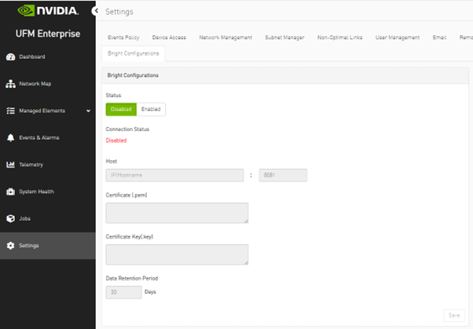
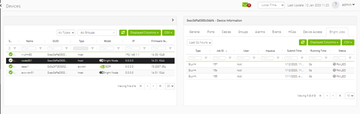

UFM Bright Integration Plugin
--------------------------------------------------------

This plugin allows augmentation of network perspective in UFM with the data provided by Bright Cluster Manager (hereafter BCM.) That effectively allows 
improving the network-centered RCA tasks and properly scope the workload failure domain.

Overview
--------------------------------------------------------

The bright plugin is a UFM plugin responsible to connect to a preconfigured 
BCM and periodically refreshes the list of nodes entities and gathers all 
available node status information and jobs assigned inside the connected BCM.

Plugin Deployment
--------------------------------------------------------

### To deploy the plugin on UFM-SDN Appliance Gen2.5:

- Login as admin
- Run 

    > enable
    
    > config terminal

- Make sure that UFM is running

    > show ufm status
- if UFM is down then run it

    > ufm start
  
- Make sure docker is running
  
    > no docker shutdown
  
- Load the latest plugin container
  - In case of HA, load the plugin on the standby node as well;
  - if your appliance is connected to the internet, you could simply run:
    > docker pull mellanox/ufm-plugin-bright
  - if your appliance is not connected to the internet, you need to load the image offline 
    - Use a machine that is connected to the internet to save the docker image 
      > docker save mellanox/ufm-plugin-bright:latest | gzip > ufm-plugin-bright.tar.gz
    - Move the file to scp shared location that is accessible to the appliance 
    - Fetch the image to the appliance 
      > image fetch scp://user@hostname/path-to-file/ufm-plugin-bright.tar.gz
    - Load the image
      > docker load ufm-plugin-bright.tar.gz
- Enable & start the plugin 

    > ufm plugin bright add
    
    
-	Check that plugin is up and running with

    > show ufm plugin

### To deploy the plugin on UFM Docker container / UFM-SDN Appliance Gen 3:
  - Load the latest plugin container
      - In case of HA, load the plugin on the standby node as well;
      - if your machine is connected to the internet, you could simply run:
        > docker pull mellanox/ufm-plugin-bright
      - if your appliance is not connected to the internet, you need to load the image offline 
        - Use a machine that is connected to the internet to save the docker image 
          > docker save mellanox/ufm-plugin-bright:latest | gzip > ufm-plugin-bright.tar.gz
        - Move the file to some shared location that is accessible to the UFM machine 
        - Load the image to UFM machine
          > docker load < /[some-shared-location]/ufm-plugin-bright.tar.gz
      - In case of UFM-SDN Appliance Gen 3, you need to make sure that the port of endpoint is opened:
          >ufw show
          * You should see the port 8982 listed, otherwise you need open it by:
            > ufw allow 8982
        
- Enable & start the plugin
    > docker exec ufm /opt/ufm/scripts/manage_ufm_plugins.sh add -p bright  

- Check that plugin is up and running with
    
    
    > docker exec ufm /opt/ufm/scripts/manage_ufm_plugins.sh show

### To deploy the plugin with UFM Enterprise (SA or HA):
- Install the latest version of UFM.
 
- Load the latest plugin container
  - In case of HA, load the plugin on the standby node as well;
  - if your machine is connected to the internet, you could simply run:
    > docker pull mellanox/ufm-plugin-bright
  - if your appliance is not connected to the internet, you need to load the image offline 
    - Use a machine that is connected to the internet to save the docker image 
      > docker save mellanox/ufm-plugin-bright:latest | gzip > ufm-plugin-bright.tar.gz
    - Move the file to some shared location that is accessible to the UFM machine 
    - Load the image to UFM machine
      > docker load < /[some-shared-location]/ufm-plugin-bright.tar.gz
      
- To enable & start the plugin, run :

    > /opt/ufm/scripts/manage_ufm_plugins.sh add -p bright
  
- Check that plugin is up and running with
 
    >docker ps;

Log file bright_plugin.log is located in /opt/ufm/files/log on the host.

Usage
--------------------------------------------------------

### 1.Connect to the BCM

To connect to the bright cluster manager, after you make sure that you deployed the bright plugin successfully, 
you can navigate to the UFM WEB GUI -> Settings -> Bright Configuration

You should fill the below required configurations:

|       Parameter       |                                               Description                                               |
|:---------------------:|:-------------------------------------------------------------------------------------------------------:|
|         Host          |                                    Hostname or IP of the BCM server                                     |
|         Port          |                              Port of the BCM server, normally will be 8081                              |
|      Certificate      |    BMC client certificate content that could be located in the BMC server machine under .cm/XXX.pem     |
|    Certificate key    |      BMC client certificate key that could be located in the BMC server machine under .cm/XXX.key       |
| Data retention period | UFM erases the data gathered in the database after the configured retention period. By default, 30 days |

### 2. View the bright nodes & jobs data:

   After you make sure that you completed the configurations successfully, and you have a healthy connection with the BMC,
   you can navigate to the UFM Web GUI -> Managed Elements -> Devices:

