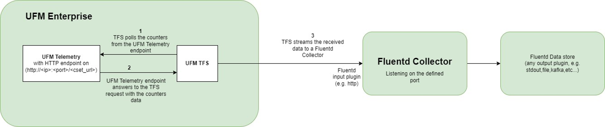
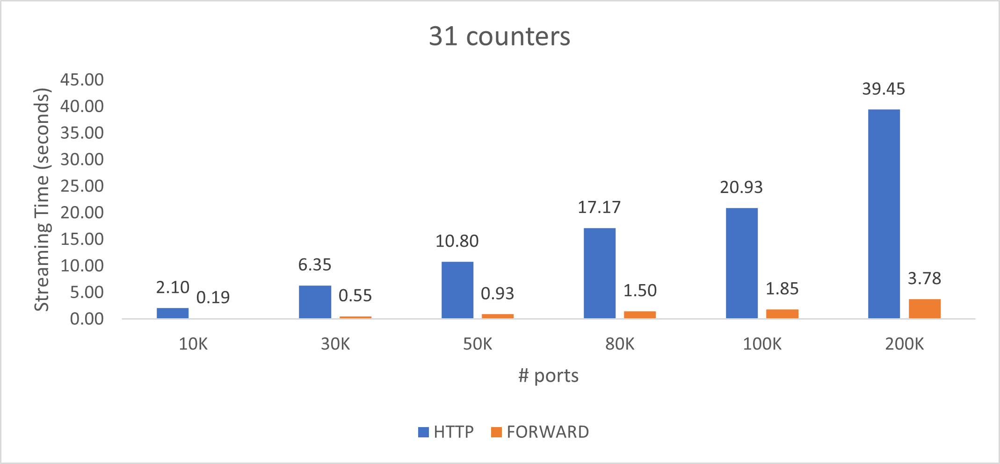
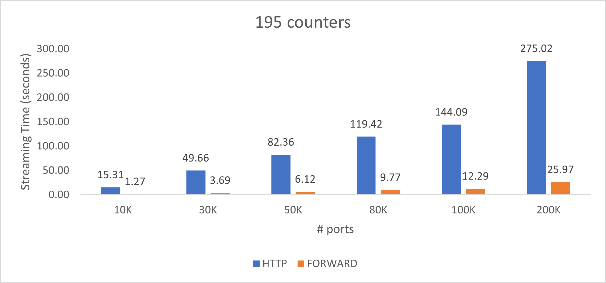

UFM Telemetry endpoint stream To Fluentd endpoint (TFS)
--------------------------------------------------------


TFS plugin is a self-contained Docker container with REST API support, managed by UFM. It is designed to extract the [UFM Telemetry](https://docs.mellanox.com/category/ufmenterprise) counters from the configured telemetry HTTP endpoint(s) and stream them to the configured [Fluent](https://www.fluentd.org/) collector destination.




Overview
--------------------------------------------------------

NVIDIA UFM Telemetry platform provides network validation tools to monitor network performance and conditions, capturing and streaming rich real-time network telemetry information, application workload usage to an on-premise or cloud-based database for further analysis.
As a fabric manager, the UFM Telemetry holds real-time network telemetry information of the network topology. This information should be reflected, over time (as it can change with time) towards telemetry console. In order to do so, we present stream the UFM Telemetry data to the [Fluentd](https://www.fluentd.org/) plugin


Deployment
--------------------------------------------------------

<details>
    <summary>
        <h3>Deploy the plugin on UFM-SDN Appliance</h3>
    </summary>


- Login as admin

- Run 


    ```bash
    enable
    ```

    ```bash
    config terminal
    ```
  

- Make sure that UFM is running


    ```bash
    show ufm status
    ```
    - If UFM is down then run it

        ```bash
        ufm start
        ```
  
- Make sure docker is running
  
    ```bash
    no docker shutdown
    ```
  
- Load the latest plugin's docker image
  - In case of HA, load the plugin on the standby node as well.
  - If your appliance is connected to the internet, you could simply run:
    ```bash
    docker pull mellanox/ufm-plugin-tfs
    ```
  - If your appliance is not connected to the internet, you need to load the image offline 
    - Use a machine that is connected to the internet to save the docker image 
      ```bash
      docker save mellanox/ufm-plugin-tfs:latest | gzip > ufm-plugin-tfs.tar.gz
      ```
    - Move the file to scp shared location that is accessible to the appliance.
    - Fetch the image to the appliance 
      ```bash
      image fetch scp://user@hostname/path-to-file/ufm-plugin-tfs.tar.gz
      ```
    - Load the image
      ```bash
      docker load ufm-plugin-tfs.tar.gz
      ```
- Enable & start the plugin 

    ```bash
    ufm plugin tfs add
    ```
    
    
- Check that the plugin is up and running with

    ```bash
    show ufm plugin
    ```

</details>


<details>
    <summary>
        <h3>Deploy the plugin with UFM Enterprise [Bare-metal/Docker] </h3>
    </summary>
    

- Load the latest plugin container
  - In case of HA, load the plugin on the standby node as well;
  - If your machine is connected to the internet, you could simply run:

    ```bash
    docker pull mellanox/ufm-plugin-tfs
    ```

      - If your UFM machine is not connected to the internet, you need to load the image offline 
        - Use a machine that is connected to the internet to save the docker image

          ```bash
          docker save mellanox/ufm-plugin-tfs:latest | gzip > ufm-plugin-tfs.tar.gz
          ```

        - Move the file to some shared location that is accessible to the UFM machine 
        - Load the image to UFM machine
          ```bash
          docker load -i < /[some-shared-location]/ufm-plugin-tfs.tar.gz
          ```
        
- Enable & start the plugin
    - UFM bare-metal installation:
    ```bash
    /opt/ufm/scripts/manage_ufm_plugins.sh add -p tfs
    ```

    - UFM docker installation:
    ```bash
    docker exec ufm /opt/ufm/scripts/manage_ufm_plugins.sh add -p tfs
    ```


- Check that plugin is up and running with
    - UFM bare-metal installation:
    ```bash
    /opt/ufm/scripts/manage_ufm_plugins.sh show
    ```

    - UFM docker installation:
    ```bash
    docker exec ufm /opt/ufm/scripts/manage_ufm_plugins.sh show
    ```    
</details>

<details>
<summary>

FluentdD Deployment configurations
--------------------------------------------------------

</summary>

- Pull the [Fluentd Docker](https://hub.docker.com/r/fluent/fluentd/) by running:

  ```bash
  docker pull fluent/fluentd
  ```
    
- Run the Fluentd docker by running:

  ```bash
  docker run -ti --rm --network host -v /tmp/fluentd:/fluentd/etc fluentd -c /fluentd/etc/fluentd.conf -v
  ```

* We provide [fluentd.conf](conf/fluentd.conf) as a fluentd configurations sample.
* TFS supports [FORWARD](https://docs.fluentd.org/input/forward) and [HTTP](https://docs.fluentd.org/input/http) protocols for sending the data to the Fluent destination. The **FORWARD** is the default protocol, to switch to the **HTTP** protocol, need to enable [streaming.compressed_streaming](conf/fluentd_telemetry_plugin.cfg#L15)

</details>

<details>
    <summary>

IPv6 configurations
--------------------------------------------------------        
</summary>

TFS supports streaming the data into the Fluent destination via the IPv6, you need to make sure that the Fluent is listening to the IPv6 interface by replacing [fluentd host address](conf/fluentd.conf#L4) (bind 0.0.0.0) with (bind ::)

</details>

The TFS logs file is located under `/opt/ufm/files/log/plugins/tfs/tfs.log` on the host. For UFM versions that less than **6.17.0**, the logs file is located under `/opt/ufm/files/log/tfs.log`

Usage
--------------------------------------------------------

<details>
    <summary>
        <h3>
            TFS Configuration Parameters Details
        </h3>
    </summary>

|                                         Parameter                                         | Required |                                                                                              Description                                                                                               |                         Default                         |
|:-----------------------------------------------------------------------------------------:|:--------:|:------------------------------------------------------------------------------------------------------------------------------------------------------------------------------------------------------:|:-------------------------------------------------------:|
|               [fluentd-endpoint.host](conf/fluentd_telemetry_plugin.cfg#L7)               |   True   |                                                                             Hostname or IPv4 or IPv6 for Fluentd endpoint                                                                              |                                                         |
|               [fluentd-endpoint.port](conf/fluentd_telemetry_plugin.cfg#L8)               |   True   |                                          Port for Fluentd endpoint [this port should be the port which is configured in [fluentd.conf](conf/fluentd.conf#L4)]                                          |                          24225                          |
|             [fluentd-endpoint.timeout](conf/fluentd_telemetry_plugin.cfg#L9)              |   True   |                                                                           Timeout in seconds for Fluentd endpoint streaming                                                                            |                           120                           |
|            [ufm-telemetry-endpoint.host](conf/fluentd_telemetry_plugin.cfg#L2)            |   True   |                                                                        Hostname or IPv4 or IPv6 for The UFM Telemetry Endpoint                                                                         |                        127.0.0.1                        |
|            [ufm-telemetry-endpoint.port](conf/fluentd_telemetry_plugin.cfg#L3)            |   True   |                                                                                  Port for The UFM Telemetry Endpoint                                                                                   |                          9001                           |
|            [ufm-telemetry-endpoint.url](conf/fluentd_telemetry_plugin.cfg#L4)             |   True   |                                                            URL for The UFM Telemetry Endpoint, for Prometheus format you can use 'metrics'                                                             |                      'csv/metrics'                      |
|         [ufm-telemetry-endpoint.interval](conf/fluentd_telemetry_plugin.cfg#L13)          |   True   |                                                                                     Streaming interval in seconds                                                                                      |                           30                            |
|     [ufm-telemetry-endpoint.message_tag_name](conf/fluentd_telemetry_plugin.cfg#L10)      |  False   |                                                                             Message Tag Name for Fluentd endpoint message                                                                              | ufm-telemetry-endpoint.host:ufm-telemetry-endpoint.port |
|          [ufm-telemetry-endpoint.xdr_mode](conf/fluentd_telemetry_plugin.cfg#7)           |   True   |                          If True for a specific UFM telemetry endpoint, the TFS will start collecting/streaming the configured ports types specified under “xdr_ports_types”                           |                          False                          |
|       [ufm-telemetry-endpoint.xdr_ports_types](conf/fluentd_telemetry_plugin.cfg#8)       |   True   |                                                 List of XDR port types that the TFS should collect and stream from a specified UFM telemetry endpoint                                                  |             'legacy', 'plane', 'aggregated'             |
|             [streaming.bulk_streaming](conf/fluentd_telemetry_plugin.cfg#L14)             |   True   |                                     if True all telemetry records will be streamed in one message; otherwise, each record will be streamed in a separated message                                      |                          True                           |
|          [streaming.compressed_streaming](conf/fluentd_telemetry_plugin.cfg#L15)          |   True   | if True, the streamed data will be sent gzipped json and you have to make sure to configure the FluentD receiver with the right configurations; otherwise, the message will be sent plain text as json |                          False                          |
|        [streaming.stream_only_new_samples](conf/fluentd_telemetry_plugin.cfg#L16)         |   True   |                                                                        If True, the plugin will stream only the changed values                                                                         |                          True                           |
|                [streaming.enabled](conf/fluentd_telemetry_plugin.cfg#L17)                 |   True   |                                                         If True, the streaming will be started once the required configurations have been set                                                          |                          False                          |
| [streaming.enable_cached_stream_on_telemetry_fail](conf/fluentd_telemetry_plugin.cfg#L20) |   True   |                            If True, it will enable the fallback option to stream cached data from the last successful iteration when the telemetry endpoint is unavailable.                            |                          True                           |
|            [logs-config.logs_file_name](conf/fluentd_telemetry_plugin.cfg#L20)            |   True   |                                                                                             Log file name                                                                                              |                      /log/tfs.log                       |
|              [logs-config.logs_level](conf/fluentd_telemetry_plugin.cfg#L22)              |   True   |                                                                                          Logs severity level                                                                                           |                          INFO                           |
|          [logs-config.max_log_file_size](conf/fluentd_telemetry_plugin.cfg#L24)           |   True   |                                                                                     Maximum log file size in Bytes                                                                                     |                          10 MB                          |
|        [logs-config.log_file_backup_count](conf/fluentd_telemetry_plugin.cfg#L26)         |   True   |                                                                                   Maximum number of backup log files                                                                                   |                            5                            |


</details>

<details>
    <summary>
        <h3>Set / Update the plugin's configurations</h3>
    </summary>

The following REST API is provided to set the plugin's configurations:

   > METHOD: **_POST_**
   
   > URL: **_https://[HOST-IP]/ufmRest/plugin/tfs/conf_**

   cURL Example:
   ```curl
curl --location 'https://<UFM_IP>/ufmRest/plugin/tfs/conf' \
--header 'Content-Type: application/json' \
--data '{
    "fluentd-endpoint": {
        "host": "<FLUENT_RECIEVER_IP>",
        "port": 24224,
        "timeout": 120
    },
    "streaming": {
        "enabled": true,
        "stream_only_new_samples": false
    },
    "ufm-telemetry-endpoint": [
        {
            "host": "127.0.0.1",
            "interval": <COLLECTING_INTERVAL_SECONDS, e.g. 30>,
            "port": <TELEMETRY_HTTP_PORT, e.g. 9001>,
            "url": <TELEMETRY_CSET_URL, e.g. csv/metrics OR csv/cset/converted_enterprise>
        }
    ]
}' -k -u <UFM_USERNAME>:<UFM_PASSWORD>
   ```
   
   Full Payload Example:
   ```json
{
        "ufm-telemetry-endpoint": [{
            "host": "127.0.0.1",
            "url": "csv/metrics",
            "port": 9001,
            "interval": 30,
            "message_tag_name": "high_freq_endpoint",
            "xdr_mode": false,
            "xdr_ports_types": [
              "legacy",
              "aggregated",
              "plane"
            ]
        }],
        "fluentd-endpoint": {
            "host": "10.209.36.68",
            "port": 24226
        },
        "streaming": {
            "compressed_streaming": false,
            "bulk_streaming": true,
            "enable_cached_stream_on_telemetry_fail": true,
            "enabled": true,
            "stream_only_new_samples": true
        },
        "logs-config": {
            "log_file_backup_count": 5,
            "log_file_max_size": 10485760,
            "logs_file_name": "/log/tfs.log",
            "logs_level": "INFO"
        },
        "meta-fields":{
            "alias_node_description": "node_name",
            "alias_node_guid": "AID",
            "add_type":"csv"
        }
    }
   ```

</details>

<details>
    <summary>
       <h3>Get the plugin configurations</h3>
    </summary>

The following REST API is provided to get the current plugin's configurations:


   > METHOD: **_GET_**
   
   > URL: **_https://[HOST-IP]/ufmRest/plugin/tfs/conf_**

cURL Example:
   ```curl
    curl --location 'https://<UFM_IP>/ufmRest/plugin/tfs/conf' -k -u <UFM_USERNAME>:<UFM_PASSWORD>
   ```

Response Example:
   ```json
{
        "ufm-telemetry-endpoint": [{
            "host": "127.0.0.1",
            "url": "csv/metrics",
            "port": 9001,
            "interval": 30,
            "message_tag_name": "high_freq_endpoint",
            "xdr_mode": false,
            "xdr_ports_types": [
              "legacy",
              "aggregated",
              "plane"
            ]
        }],
        "fluentd-endpoint": {
            "host": "10.209.36.68",
            "port": 24226
        },
        "streaming": {
            "compressed_streaming": false,
            "bulk_streaming": true,
            "enabled": true,
            "enable_cached_stream_on_telemetry_fail": true,
            "stream_only_new_samples": true
        },
        "logs-config": {
            "log_file_backup_count": 5,
            "log_file_max_size": 10485760,
            "logs_file_name": "/log/tfs.log",
            "logs_level": "INFO"
        },
        "meta-fields":{
            "alias_node_description": "node_name",
            "alias_node_guid": "AID",
            "add_type":"csv"
        }
    }
   ```
    

</details>

<details>
    <summary>
        <h3>Streaming data from multiple UFM Telemetry endpoints</h3>
    </summary>

You can configure the TFS plugin to poll metrics from multiple endpoints. To do this, add the telemetry endpoint configurations using the conf API. 
Each added endpoint will have its own polling/streaming interval.

Payload example with multiple UFM Telemetry endpoints:

   ```json
{
        "ufm-telemetry-endpoint": [{
            "host": "127.0.0.1",
            "url": "csv/metrics",
            "port": 9001,
            "interval": 10,
            "message_tag_name": "high_freq_endpoint"
        },{
            "host": "127.0.0.1",
            "url": "csv/metrics",
            "port": 9002,
            "interval": 60,
            "message_tag_name": "low_freq_endpoint"
        }],
        "fluentd-endpoint": {
            "host": "10.209.36.68",
            "port": 24226
        }
    }
   ```

</details>

<details>
    <summary>
        <h3>Sharding in UFM Telemetry</h3>
    </summary>

The sharding functionality that is built into UFM telemetry, 
allows for efficient data polling from multiple telemetry metrics endpoints. 
This feature is particularly useful when dealing with large amounts of data or when operating in a network with limited bandwidth.

<h4>How To Utilize Sharding in TFS:</h4>

To use the sharding functionality, you need to add specific parameters to the URL of the configured telemetry endpoint.
These parameters include **num_shards**, **shard**, and **sharding_field**.

Here is a payload example of how to use these parameters with the TFS configurations payload:

   ```json
{
        "ufm-telemetry-endpoint": [{
            "host": "127.0.0.1",
            "url": "csv/xcset/ib_basic_debug?num_shards=3&shard=0&sharding_field=port_guid",
            "port": 9002,
            "interval": 120
        },{
            "host": "127.0.0.1",
            "url": "csv/xcset/ib_basic_debug?num_shards=3&shard=1&sharding_field=port_guid",
            "port": 9002,
            "interval": 120
        },{
            "host": "127.0.0.1",
            "url": "csv/xcset/ib_basic_debug?num_shards=3&shard=2&sharding_field=port_guid",
            "port": 9002,
            "interval": 120
        }],
        "fluentd-endpoint": {
            "host": "10.209.36.68",
            "port": 24226
        }
    }
   ```

In this example, the telemetry data is divided into three shards (`num_shards=3`), 
and each endpoint with a different shard (`shard=0`, `shard=1`, `shard=2`). 
The `sharding_field` parameter is used to specify the field on which the data is to be sharded.
In the provided example, `sharding_field` is set to `port_guid`. 
This means that the data is divided into shards based on the `port_guid` field. 
This field was chosen because it provides a convenient way to divide the data into distinct, non-overlapping shards.

<h4>Tuning the Sharding:</h4>

For optimal performance, it is recommended to tune the sharding so that a single shard transfers in about 10-15 seconds. This leaves plenty of overhead to avoid the telemetry's server timeout issues. 
You may need to experiment with the number of shards to achieve this. For instance, if your network is slow, you might need to increase the number of shards.

</details>

<details>
    <summary>
        <h3>Adding customized meta-field records to the TFS messages</h3>
    </summary>
   
   Meta-fields are custom fields that you can add to each record streamed through TFS. There are two types of meta-fields: Aliases and Constants.

        
**Aliases**
    Aliases allow you to rename an existing field in the record. To create an alias, specify the original field name and the new name you want to use. Note that aliases only work with fields that match the exact name specified.

 - **Syntax**

    > alias_originalFieldName=aliasName

 - **Example**
If you want to rename the field "node_guid" to "AID", you would use:

    > alias_node_guid=AID

**Constans**
    Constants let you add a new field with a fixed value to each record.

 - **Syntax**

    > add_newFieldName=constantValue

 - **Example**
To add a new field named "type" with the value "csv", you would use:

    > add_type=csv

**Payload configurations example**
    Here’s how you can define these meta-fields in the TFS configuration payload:
```json
{
    "meta-fields": {
        "alias_node_description": "node_name",
        "alias_node_guid": "AID",
        "add_type": "csv"
    }
}
```

**Expected output**

```json
{
      "timestamp": "1644411135311315",
      "source_id": "0xe41d2d030003e450",
      "node_guid": "e41d2d030003e450",
      "port_guid": "e41d2d030003e450",
      "port_num": "10",
      "node_description": "SwitchIB Mellanox Technologies",
      "node_name": "SwitchIB Mellanox Technologies",
      "AID": "e41d2d030003e450",
      "type": "csv"
}
```
</details>

<details>
    <summary>
        <h3>Customizing the telemetry's attributes / counters</h3>
    </summary>
You can customize which counters to stream and how they named using the REST API.

- Get the current attributes configurations by the following REST API:

   > METHOD: **_GET_**
   
   > URL: **_https://[UFM-IP]/ufmRest/plugin/tfs/conf/attributes_**

    cURL Example:
    ```curl
     curl --location 'https://<UFM_IP>/ufmRest/plugin/tfs/conf/attributes' -k -u <UFM_USERNAME>:<UFM_PASSWORD>
    ```
   
    Response Example:

    JSON contains all the attributes and their configurations:
   
    ```json
    { 
    "ExcessiveBufferOverrunErrorsExtended": {
        "enabled": true,
        "name": "ExcessiveBufferOverrunErrorsExtended"
     },
    "LinkDownedCounterExtended": {
        "enabled": true,
        "name": "LinkDownedCounterExtended"
     },
      "LinkErrorRecoveryCounterExtended": {
        "enabled": true,
        "name": "LinkErrorRecoveryCounterExtended"
     },
      "LocalLinkIntegrityErrorsExtended": {
        "enabled": true,
        "name": "LocalLinkIntegrityErrorsExtended"
     }
    }
    ```

- Update the streaming attributes configurations by the following REST API:

   > METHOD: **_POST_**
   
   > URL: **_https://[UFM-IP]/ufmRest/plugin/tfs/conf/attributes_**

   cURL Example:
   ```curl
    curl --location 'https://<UFM_IP>/ufmRest/plugin/tfs/conf/attributes' \
    --header 'Content-Type: application/json' \
    --data '{
         "ExcessiveBufferOverrunErrorsExtended": {
            "enabled": true,
            "name": "ExcBuffOverrunErrExt"
        },
        "LinkDownedCounterExtended": {
            "enabled": false
        },
        "LinkErrorRecoveryCounterExtended": {
            "enabled": true,
            "name": "linkErrRecCountExt"
        },
        "LocalLinkIntegrityErrorsExtended": {
            "enabled": true,
            "name": "localLinkIntErrExt"
        }
    }' -k -u <UFM_USERNAME>:<UFM_PASSWORD>       
    ```

|     Parameter     | Required |                         Description                          |
|:-----------------:|:--------:|:------------------------------------------------------------:|
| attribute.enabled |   True   | If True, the **attribute** will be part of the streamed data |
|  attribute.name   |   True   |   The name of the **attribute** in the streamed json data    |

* Changes to attribute configurations are applied automatically and will take effect during the next streaming period.

</details>

<details>
    <summary>
        <h3>Monitor the streaming performance & statistics</h3>
    </summary>

  Prometheus HTTP endpoint is provided, that contains metrics about the streaming performance & statistics for the last streaming period.

- Get the streaming performance statistics by the following API:

   > METHOD: **_GET_**
   
   > URL: **_https://[UFM-IP]/ufmRest/plugin/tfs/metrics_**
   
   Response: Text contains performance metrics for the last streaming interval in Prometheus format:
   
    ```text
    # HELP num_of_processed_counters_in_last_msg Number of processed counters/attributes in the last streaming interval
    # TYPE num_of_processed_counters_in_last_msg gauge
    num_of_processed_counters_in_last_msg{endpoint="10.209.36.68:9001/csv/xcset/ib_basic_debug"} 176.0
    num_of_processed_counters_in_last_msg{endpoint="10.209.36.67:9001/csv/xcset/ib_basic_debug"} 189.0
    # HELP num_of_streamed_ports_in_last_msg Number of processed ports in the last streaming interval
    # TYPE num_of_streamed_ports_in_last_msg gauge
    num_of_streamed_ports_in_last_msg{endpoint="10.209.36.68:9001/csv/xcset/ib_basic_debug"} 6.0
    num_of_streamed_ports_in_last_msg{endpoint="10.209.36.67:9001/csv/xcset/ib_basic_debug"} 4.0
    # HELP streaming_time_seconds Time period for last streamed message in seconds
    # TYPE streaming_time_seconds gauge
    streaming_time_seconds{endpoint="10.209.36.68:9001/csv/xcset/ib_basic_debug"} 0.064626
    streaming_time_seconds{endpoint="10.209.36.67:9001/csv/xcset/ib_basic_debug"} 0.025279
    # HELP telemetry_expected_response_size_bytes Expected size of the last received telemetry response in bytes
    # TYPE telemetry_expected_response_size_bytes gauge
    telemetry_expected_response_size_bytes{endpoint="10.209.36.68:9001/csv/xcset/ib_basic_debug"} 5156.0
    telemetry_expected_response_size_bytes{endpoint="10.209.36.67:9001/csv/xcset/ib_basic_debug"} 4726.0
    # HELP telemetry_received_response_size_bytes Actual size of the last received telemetry response in bytes
    # TYPE telemetry_received_response_size_bytes gauge
    telemetry_received_response_size_bytes{endpoint="10.209.36.68:9001/csv/xcset/ib_basic_debug"} 5156.0
    telemetry_received_response_size_bytes{endpoint="10.209.36.67:9001/csv/xcset/ib_basic_debug"} 4726.0
    # HELP telemetry_response_time_seconds Response time of the last telemetry request in seconds
    # TYPE telemetry_response_time_seconds gauge
    telemetry_response_time_seconds{endpoint="10.209.36.68:9001/csv/xcset/ib_basic_debug"} 0.028893
    telemetry_response_time_seconds{endpoint="10.209.36.67:9001/csv/xcset/ib_basic_debug"} 0.07777
    # HELP telemetry_response_process_time_seconds Processing time of the last received telemetry response in seconds
    # TYPE telemetry_response_process_time_seconds gauge
    telemetry_response_process_time_seconds{endpoint="10.209.36.68:9001/csv/xcset/ib_basic_debug"} 0.00455
    telemetry_response_process_time_seconds{endpoint="10.209.36.67:9001/csv/xcset/ib_basic_debug"} 0.003142
    ```


    |                Attribute                |                            Description                             |
    |:---------------------------------------:|:------------------------------------------------------------------:|
    |    num_of_streamed_ports_in_last_msg    |        # of processed ports in the last streaming interval         |
    |  num_of_processed_counters_in_last_msg  | # of processed counters/attributes in the last streaming interval  |
    |         streaming_time_seconds          |          Time period for last streamed message in seconds          |
    | telemetry_expected_response_size_bytes  |   Expected size of the last recivied telemetry response in bytes   |
    | telemetry_received_response_size_bytes  |    Actual size of the last recivied telemetry response in bytes    |
    |     telemetry_response_time_seconds     |       Response time of the last telemetry request in seconds       |
    | telemetry_response_process_time_seconds | Processing time of the last recivied telemetry response in seconds |

The below charts present the total processing and streaming time for various sets of ports & counters does not include the real telemetry response time for requesting the data:





</details>
