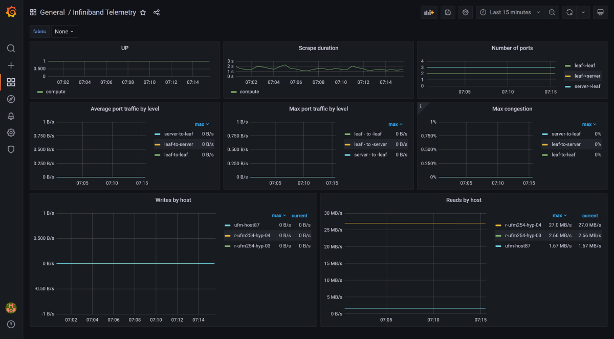

UFM Grafana Infiniband Telemetry
--------------------------------------------------------

This plugin provides a new UFM telemetry prometheus endpoint with more human-readable labels (e.g. the device name, port number,etc...) instead of the labels that based on the GUIDs on the original UFM telemetry endpoint.
The new telemetry endpoint could be consumed by the [Prometheus Server](https://prometheus.io/) to collect the metrics with their labels, and then the collected metrics could be monitored using [Grafana](https://grafana.com/)

Overview
--------------------------------------------------------

NVIDIA UFM Telemetry platform provides network validation tools to monitor network performance and conditions, capturing and streaming rich real-time network telemetry information, application workload usage to an on-premise or cloud-based database for further analysis.
As a fabric manager, the UFM Telemetry holds a real-time network telemetry information of the network topology. This information should be monitored, over time (as it can change with time) towards a monitoring system like Grafana. In order to do so, we present UFM Telemetry Grafana Plugin.

Plugin Deployment
--------------------------------------------------------

### To deploy the plugin on UFM-SDN Appliance Gen2.5:

- Login as admin
- Run 


    > enable
    
    > config terminal

- Make sure that UFM is running


    > show ufm status
- if UFM is down then run it

    > ufm start
  
- Make sure docker is running
  
    > no docker shutdown
  
- Load the latest plugin container
  - In case of HA, load the plugin on the standby node as well;
  - if your appliance is connected to the internet, you could simply run:
    > docker pull mellanox/ufm-plugin-grafana-dashboard
  - if your appliance is not connected to the internet, you need to load the image offline 
    - Use a machine that is connected to the internet to save the docker image 
      > docker save mellanox/ufm-plugin-grafana-dashboard:latest | gzip > ufm-plugin-grafana-dashboard.tar.gz
    - Move the file to scp shared location that is accessible to the appliance 
    - Fetch the image to the appliance 
      > image fetch scp://user@hostname/path-to-file/ufm-plugin-grafana-dashboard.tar.gz
    - Load the image
      > docker load ufm-plugin-grafana-dashboard.tar.gz
- Enable & start the plugin 

    > ufm plugin grafana-dashboard add
    
    
-	Check that plugin is up and running with

    > show ufm plugin


### To deploy the plugin on UFM Docker container / UFM-SDN Appliance Gen 3:
  - Load the latest plugin container
      - In case of HA, load the plugin on the standby node as well;
      - if your machine is connected to the internet, you could simply run:
        > docker pull mellanox/ufm-plugin-grafana-dashboard
      - if your appliance is not connected to the internet, you need to load the image offline 
        - Use a machine that is connected to the internet to save the docker image 
          > docker save mellanox/ufm-plugin-grafana-dashboard:latest | gzip > ufm-plugin-grafana-dashboard.tar.gz
        - Move the file to some shared location that is accessible to the UFM machine 
        - Load the image to UFM machine
          > docker load < /[some-shared-location]/ufm-plugin-grafana-dashboard.tar.gz
      - In case of UFM-SDN Appliance Gen 3, you need to make sure that the port of endpoint is opened:
          >ufw show
          * You should see the port 8982 listed, otherwise you need open it by:
            > ufw allow 8982
        
- Enable & start the plugin
    > docker exec ufm /opt/ufm/scripts/manage_ufm_plugins.sh add -p grafana-dashboard  


- Check that plugin is up and running with
    
    
    > docker exec ufm /opt/ufm/scripts/manage_ufm_plugins.sh show


### To deploy the plugin with UFM Enterprise (SA or HA):
- Install the latest version of UFM.
 
- Load the latest plugin container
  - In case of HA, load the plugin on the standby node as well;
  - if your machine is connected to the internet, you could simply run:
    > docker pull mellanox/ufm-plugin-grafana-dashboard
  - if your appliance is not connected to the internet, you need to load the image offline 
    - Use a machine that is connected to the internet to save the docker image 
      > docker save mellanox/ufm-plugin-grafana-dashboard:latest | gzip > ufm-plugin-grafana-dashboard.tar.gz
    - Move the file to some shared location that is accessible to the UFM machine 
    - Load the image to UFM machine
      > docker load < /[some-shared-location]/ufm-plugin-grafana-dashboard.tar.gz
      
- To enable & start the plugin, run :

    > /opt/ufm/scripts/manage_ufm_plugins.sh add -p grafana-dashboard
  
- Check that plugin is up and running with
 
    >docker ps;

Log file grafana-dashboard-plugin.log is located in /opt/ufm/files/log on the host.

Usage
--------------------------------------------------------

### 1.UFM Telemetry Prometheus Metrics with Labels endpoint:

This endpoint provides the metrics and could be consumed by any Prometheus server.

> http://<UFM_HOST>:8982/labels/enterprise

### 2.Set the plugin configurations by the following API:

   METHOD: _PUT_

   URL: _https://[HOST-IP]/ufmRest/plugin/grafana-dashboard/conf_

   Payload Example:
   ```json
{
    "ufm": {
        "port": 8000
    },
    "ufm-telemetry-endpoint": {
        "host": "127.0.0.1",
        "port": 9001,
        "url": "enterprise"
    },
    "logs-config": {
        "log_file_backup_count": 5,
        "log_file_max_size": 10485760,
        "logs_file_name": "/log/grafana-dashboard-plugin.log",
        "logs_level": "INFO"
    }
}
   ```
cURL Example:
```bash
curl -XPUT 'https://10.209.36.68/ufmRest/plugin/grafana-dashboard/conf/' \
 -k \
 -u admin:123456 \
 -H 'Content-Type: application/json' \
 -d '{"ufm-telemetry-endpoint":{"host": "127.0.0.1","port": 9002,"url": "enterprise"}}'
```

Configuration Parameters Details:
--------------------------------------------------------

|                                   Parameter                                    | Required |                                                       Description                                                       |
|:------------------------------------------------------------------------------:|:--------:|:-----------------------------------------------------------------------------------------------------------------------:|
|    [ufm-telemetry-endpoint.host](conf/grafana_infiniband_telemetry_plugin.cfg#L2)     |   True   | Hostname or IPv4 or IPv6 of the original UFM Telemetry Endpoint, which is normally the localhost [Default is 127.0.0.1] |
|    [ufm-telemetry-endpoint.port](conf/grafana_infiniband_telemetry_plugin.cfg#L3)     |   True   |                              Port of the original UFM Telemetry Endpoint [Default is 9001]                              |
|     [ufm-telemetry-endpoint.url](conf/grafana_infiniband_telemetry_plugin.cfg#L3)     |   True   |                          URL of the original UFM Telemetry Endpoint [Default is 'enterprise']                           |
|    [logs-config.logs_file_name](conf/grafana_infiniband_telemetry_plugin.cfg#L10)     |   True   |                                        Log file name [Default = '/log/grafana-dashboard-plugin.log']                                         |
|      [logs-config.logs_level](conf/grafana_infiniband_telemetry_plugin.cfg#L11)       |   True   |                                                    Default is 'INFO'                                                    |
|   [logs-config.max_log_file_size](conf/grafana_infiniband_telemetry_plugin.cfg#L12)   |   True   |                                    Maximum log file size in Bytes [Default is 10 MB]                                    |
| [logs-config.log_file_backup_count](conf/grafana_infiniband_telemetry_plugin.cfg#L13) |   True   |                                    Maximum number of backup log files [Default is 5]                                    |


Notes
--------------------------------------------------------

#### 1. You can install the Prometheus & Grafana externally and configure them to consume the metrics from the endpoint#1

To install Grafana on your machine, please follow the [installation guide](https://grafana.com/docs/grafana/latest/installation/) .

To install Prometheus server on your machine, please follow the [installation guide](https://prometheus.io/download/)

a) After installing the Prometheus server, edit prometheus.yml

    # metrics_path : 'labels/enterprise'
    # static_configs
        #- targets: ["{UFM enterprise IP}:{Prometheus endpoint port, usually 8982}"]

b) Run Prometheus server.

c) Run Grafana server.

d) Add Prometheus server as data source for Grafana and name it prometheus (case-sensitive).

e) Import [Infiniband_Telemetry.json](Infiniband_Telemetry.json) to your Grafana dashboard

### Grafana Dashboard:

