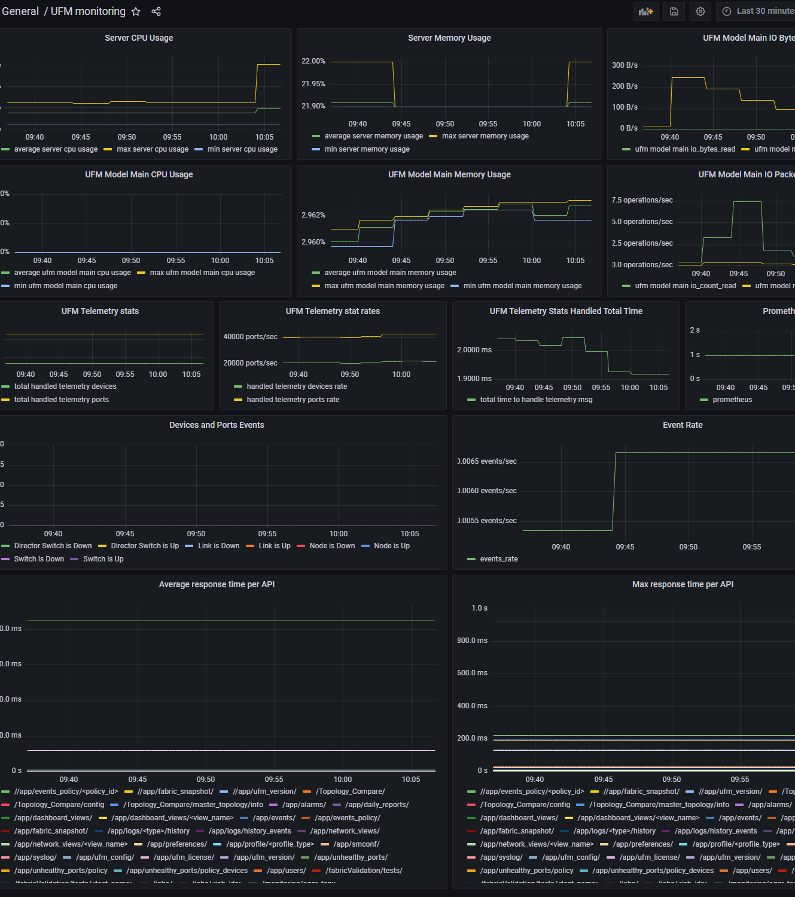

Grafana UFM System Monitoring
--------------------------------------------------------

This is to explain how to Monitor UFM System using [Grafana](https://grafana.com/) and [prometheus](https://prometheus.io/) 

we use Prometheus server to pull data from UFM Enterprise API (system_monitoring/metrics) and present it on Grafana dashboard

Prerequisites
--------------------------------------------------------

To install Grafana on your machine, please follow the [installation guide](https://grafana.com/docs/grafana/latest/installation/) .

To install Prometheus server on your machine, please follow the [installation guide](https://prometheus.io/download/)

Configuration
--------------------------------------------------------
a) Edit prometheus.yml in Prometheus Server

    # metrics_path: '/ufmRest/system_monitoring/metrics'
    # targets: ["{UFM enterprise IP}:{ufm API endpoint port, usually 443}"]
    # scheme: https
    # scrape_interval: 4m
    # metric_relabel_configs:
    #  - source_labels: [__name__]
    #    regex: 'rest_api_response_time_histogram.*'
    #    action: drop
    # basic_auth:
    #   username: '{ufm_username}'
    #   password: '{ufm_password}'

c) Run Prometheus server

d) Add Prometheus server as data source for Grafana and name it prometheus (case-sensitive)

e) Import ufm_system_monitoring to your Grafana dashboard

Use Grafana
--------------------------------------------------------
Monitor your network from Grafana dashboard!

