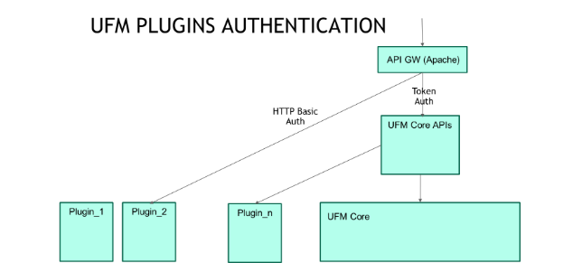

# UFM Plugins

## Overview

UFM plugins are service programs that can be dynamically loaded to extend the functionality of UFM Enterprise. 

The plugins are Docker containers, and their life cycle is being managed by UFM. 

Functions commonly added by optional UFM plugins include: 

* REST-over-RDMA (REST requests over IB to the UFM server) 
* NDT (NDT topo diff) 
* TFS (Telemetry Fluentd Streaming) 
* EFS (UFM Event Fluentd Streaming) 
* AHX Monitoring (Monitoring HDR director switch cooling devices) 

## Architecture

* Security, AAA 
* lifecycle management for 
    * Deployment 
    * Configuration 
    * Health monitoring 
    * State persistency 
    * HA 
* Presentation (UI) 
* Allows UFM capabilities extension by 3rd parties 

## Build
* The plugin’s Docker container image name convention is _ufm-plugin-<plugin name> (e.g., mellanox/ufm-plugin-tfs)_ with any tag (default tag is “latest”). 

* Each plugin should consist of the following files:

    1. _**init.sh**_ : Initialize script that should be placed in the root folder _**(/init.sh)**_ and have execute permission. It is being invoked by the UFM plugin manager upon plugin deployment (when adding a new plugin). The developer may copy the plugins configuration files to _**/config**_ folder which is mapped to the DRBD partition on the host (location on host: _/opt/ufm/files/plugins/{plugin name}_)

    2. _**deinit.sh**_ : De-initialize script that should be placed in the root folder _**(/deinit.sh)**_, have execute permission and return zero. It is being invoked by the UFM plugin manager upon plugin removal. The developer may clear files and folders that are placed on the host (e.g., log files) 

* Each plugin may have the following files:

    1. _**{plugin name}_shared_volumes.conf**_ : Contains a list of folders that are mapped between the host and the container. It consists of multiple lines in format “<host path>:<container path>” (e.g., /opt/ufm/files/log:/log). 
        * The following folders are shared between the host and the container by default: 
            1. _**{UFM files path}/conf/plugins/{plugin name}:/config**_ : This folder should contain the plugin’s configuration files. It is managed by DRBD (in case of HA) and thus, it is replicated between master and standby nodes. 
            2. _**/opt/ufm/ufm_plugins_data/{plugin name}:/data**_ : This folder may contain the plugin’s data files that should be persistent 

        * **Note**: The default folders are being removed by the UFM plugin manager upon plugin’s removal, while the plugin is responsible to remove all the files and folders which are mapped to host and are listed in shared volumes configuration file (e.g., logs files that were written to /log folder in the container which is mapped to /opt/ufm/files/log folder on the host)
    
    2. _**{plugin name}_httpd_proxy.conf**_ : Contains the port that UFM may use to forward the plugin’s HTTP request. It consists of one line in format _“port={port number}”_. All the HTTP requests to the plugin are being forwarded by the UFM server (authentication is handled by UFM). 

* **Note**: The configuration files _{plugin name}_shared_volumes.conf_ , _{plugin name}_httpd_proxy.conf_ and any custom configurations files must be copied to  _/config_ folder upon plugin deployment for UFM to manage the plugin (the plugins configuration is written to **{UFM files path}/conf/ufm_plugins.conf**

* The plugins’ ports range is 8900 - 8999. The following ports are in use: 

    * GRPC: 8901 
    * AHX:  8910 
    * NDT: 8980 
    * EFS: 8989 
    * TFS: 8981 
    * Grafana: 8982,8983,8984

* UFM Health monitors the plugin to make sure it is up and running. The following test definition should be added to each plugin in UFMHealthConfiguration.xml:

```xml
    <Test Name="<test_name>" NumOfRetriesBeforeGiveup="3" RetryTimeoutInSeconds="30">
        <TestOperation Name="PluginIsRunningTest">
            <Parameters> 
                <Parameter Name="PluginName" Value="<plugin_name>"/> 
                <Parameter Name="RunInMonitoringMode" Value="No"/> 
                <Parameter Name="RunInManagementMode" Value="Yes"/> 
            </Parameters> 
        </TestOperation>
        <CorrectiveOperation Name="RestartPlugin">
            <Parameters>
                <Parameter Name="PluginName" Value="<plugin_name>"/> 
            </Parameters> 
        </CorrectiveOperation>
        <GiveupOperation Name="None"/>
    </Test>
    ....
    <Test Name="<test_name>">
        <Frequency Value="1" MeasurementUnit="Minutes"/>
    </Test>
```

## Lifecycle
The UFM plugins lifecycle is managed by UFM. Currently, It is the user responsibility to pull/load the plugin’s Docker container image on both master and standby nodes.

* **Add** : Upon addition, the plugin’s Docker container is started, and the _**/init.sh**_ script is invoked. Its configuration files must be copied to _**/config**_ folder. The container will exit once the init stage is done and it will be re-started upon UFM startup. In case UFM is already running when the plugin is deployed, it will be started automatically.

* **Disable** : The plugin’s Docker container is stopped. However, its data is still accessible via the host. 

* **Enable** : The plugin’s Docker container is re-started. 

* **Remove** : The plugin’s Docker container is stopped, and the _**/deinit.sh**_ script is being invoked. In this stage, all the plugin’s data is removed. 

**Note**: The plugin’s Docker container is started/stopped upon UFM start/stop. In case UFM is already running when the plugin is added/enabled, it will be started. While, in case it is disabled/removed, it will be stopped 

## Authentication




## Plugin and Configurations REST APIs

The plugin's configurations should be controllable via the REST APIs (either to get the current configuration or to update/change specific configurations), and to do so we are providing basic [python flask server](../../utils/flask_server) to serve the configurations or any extra plugin's REST API by extending it in your plugin's code.

## Extendable UI Plugins

The plugin may contain separated UI (Angular) application that contains new panels/views/functionalities. and These views could be deployed as part of the UFM Web GUI or as standalone applications.

In case of deploying the UI as part of UFM Web GUI, you need to define _**{plugin name}_ui_conf.json**_, which defines the views/components that are being to be added to the UFM and where they should be added (under which section or menu or tab). Please make sure to copy this file to _**/config**_ at the plugin's deployment stage.

Currently, the UFM supports extending the following areas:
1. Adding new items to the main UFM left navigation menu [a.k.a 'leftMenu' or 'dynamicLeftMenuItems'].
2. Adding new items to the context menu of the selected devices [a.k.a 'deviceContextMenu'].
3. Adding new tabs under the Settings view [a.k.a 'settingsDetailsTabs'].
4. Adding new tabs under the selected device's information view [a.k.a 'deviceDetailsTabs'].
5. Hooking the devices data table [a.k.a 'devicesDataTable'].
6. Replacing any existing view under the UFM GUI with new plugin's view [a.k.a 'existingRoute'].

### UI Configuration Parameters Details:

|      Parameter       | Required |                                                                                                      Description                                                                                                      |
|:--------------------:|:--------:|:---------------------------------------------------------------------------------------------------------------------------------------------------------------------------------------------------------------------:|
|       mfEntry        |   True   |                                                               URL for the remoteEntry.js path that will be generated after compiling the UI application                                                               |
|         name         |   True   |                                                                                         Name of the plugin's  UI application                                                                                          |
|    exposedModule     |   True   |                                                                               Name of the exposed module in the webpack configurations                                                                                |
|     ngModuleName     |   True   |                                                                                    Class Name of the exposed module in typescript                                                                                     |
|    hookInfo.type     |   True   | The Type of the added module/view, it should be one of the following types:['leftMenu', 'dynamicLeftMenuItems', 'devicesDataTable', 'deviceDetailsTabs' ,'settingsDetailsTabs' ,'deviceContextMenu', 'existingRoute'] |
|    hookInfo.route    |   True   |                          The name of the new/existing UFM route that the added module/view should be added to (in case of type 'existingRoute', this attribute could be a string or a regex)                          |
|    hookInfo.label    |   True   |                                                                                       The displayed name of the added menu/tab                                                                                        |
|     hookInfo.key     |   True   |                                                                                         The unique key of the added menu/tab                                                                                          |
| hookInfo.pluginRoute |  False   |                                                             The plugin's route that the UFM should navigate to it after loading the plugin's module/view                                                              |
|    hookInfo.order    |  False   |                                                                                       The order of the added menu's item / tab                                                                                        |
|    hookInfo.icon     |  False   |                                                                                            Fontawsome class to menu icons                                                                                             |


You can find [this sample json](https://github.com/Mellanox/ufm_sdk_3.0/blob/main/plugins/hello_world_plugin/conf/hello_world_ui_conf.json) that contains all the supported flows

## Hello-world plugin examples

We are providing basic-hello-world plugin example that contains a simple python flask server with simple API

* To build the example plugin image, you can execute the _**build/docker_build.sh**_ script.
* The output of the build script is the plugin's image.
* You need to load the image:
> docker load -i build/ufm-plugin-basic_hello_world_latest-docker.img.gz
* Once the image is loaded, it will be discovered by the UFM Plugins Manager and manage it either by [UFM Web GUI -> Settings -> Plugins Management](https://docs.nvidia.com/networking/display/UFMEnterpriseUMLatest/Plugin+Management) or by the Plugins UFM REST API
* Once the plugin is added & started, the plugin's REST API will be accessible and also the configured UI views will be added to the UFM GUI.

And also we are providing [an advanced hello-world plugin](https://github.com/Mellanox/ufm_sdk_3.0/tree/main/plugins/hello_world_plugin) example that contains an advanced python server with some Angular UI components.
