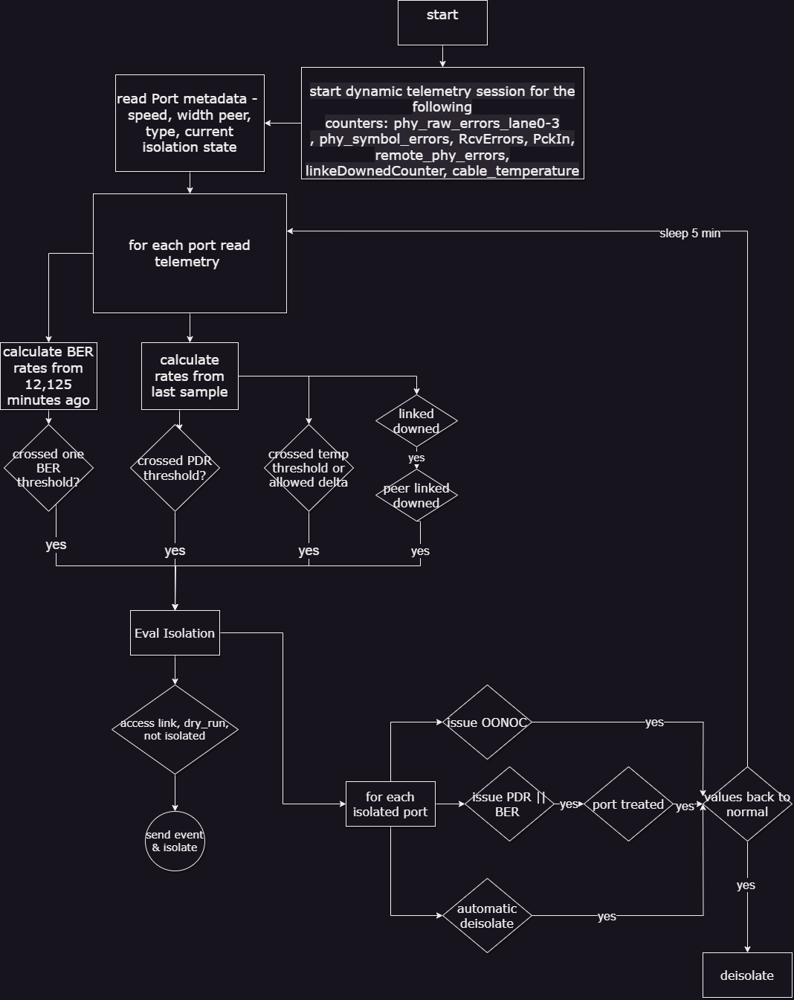

# PDR Deterministic Plugin

## Overview

The PDR deterministic plugin, overseen by the UFM, is a docker container that isolates malfunctioning ports, and then reinstates the repaired links to their previous condition by lifting the isolation. The PDR plugin uses a specific algorithm to isolate ports, which is based on telemetry data from UFM Telemetry. This data includes packet drop rate, BER counter values, link down counter, and port temperature. The plugin has a dry run mode, which allows for logging without actual port isolation. Any decisions made by the plugin will trigger an event in the UFM for tracking purposes.

The PDR plugin performs the following tasks:

1. Collects telemetry data using UFM Dynamic Telemetry
2. Identifies potential failures based on telemetry calculations and isolates them to avert any interruption to traffic flow
3. Maintains a record of maintenance procedures that can be executed to restore an isolated link
4. After performing the required maintenance, the system verifies if the ports can be deisolated and restored to operational status (brought back online).

The PDR plugin can operate in "dry_run" mode which collects the telemetry data and calculates the network telemetry but writing to the log instead of performing the actual isolation.

## Schematic flow

## Deployment

To deploy the plugin, follow these steps:

1. Download the ufm-plugin-pdr_deterministic-image from the NVIDIA License Portal (NLP).
2. Load the downloaded image onto the UFM server. This can be done either by using the UFM GUI by navigating to the Settings -> Plugins Management tab or by loading the image via the following instructions:
3. Log in to the UFM server terminal.
4. Run: docker load -I <path_to_image>
5. After successfully loading the plugin image, the plugin should become visible within the plugin management table within the UFM GUI. To initiate the plugin's execution, simply right-click on the respective in the table.

## Isolation Decisions

## NDR Link Validation Procedure

Only verify ports that are in INIT, ARMED or ACTIVE states. Track the SymbolErrorsExt of every such link for at least 120 m. So, if polling period is Pm need to keep N=(125+Pm+1) / Pm samples. Also, we compute 2 delta samples: number of samples covering 12 minutes S 12 m=(12+Pm+1) / Pm and S125m =(125+ Pm +1) / Pm. 12m_thd = LinkBW_Gbps*1e9*12*60*1e-14 (2.88 for NDR) and 125 m _thd =LinkBW_Gbps*1e9*125*60*1e-15 (3 for NDR). For every port in the given set check for the following conditions:

1. If the port Delta(LinkDownedCounterExt) >0 and the remote port Delta(LinkDownedCounterExt) >0 add it to the list of bad_ports. This condition should be ignored if the flag --no_down_count is provided.
2. If the symbol_errors[now_idx] - symbol_errors[now_idx -S12m]>12 m _thd, add the link to the list of bad_ports, continue with next link
3. If the symbol_errors[now_idx] - symbol_errors[now_idx - S125m] >125 m _thd, add the link to the list of bad_ports, continue with next link

## Packet Drop Rate Criteria

When packet drops due to the link health are detected, it makes sense to isolate the link. It is a strong indication of its bad status. For that sake a target packet_drop/packet_delivered can be used to add TX ports which their receiver has higher than this threshold to the bad_ports list. The drawback of this method is that such links may fluctuate between bad/good state since their BER may be normal. So, a good approach is to manage their statistics over time and avoid adding them back after their second or third de-isolation.

## Return to Service

Tracking the set of bad_ports, the plugin should be able to continue evaluating their BER and decide to de-isolate them when they cross the 126 m test cleanly.

## Configuration

The following parameters are configurable via the plugin's configuration file. (pdr_deterministic.conf)

| Name | Description | Default Value |
| --- | --- | --- |
| INTERVAL | interval for requesting telemetry counters. in seconds. | 300 |
| MAX_NUM_ISOLATE | maximum ports to be isolated. max(MAX_NUM_ISOLATE, 0.5% * fabric_size) | 10 |
| TMAX | Maximum temperature threshold | 70 (Celsius) |
| D_TMAX | Maximum allowed Temperature Delta | 10 |
| MAX_PDR | Max allowed packet drop rate | 1e-12 |
| CONFIGURED_BER_CHECK | if set to true, the plugin will isolate based on BER calculations | True |
| CONFIGURED_TEMP_CHECK | if set to true, the plugin will isolate based on temperature measurements | True |
| LINK_DOWN_ISOLATION | if set to true, the plugin will isolate based on LinkDownedCounterExt measurements | True |
| SWITCH_TO_HOST_ISOLATION | if set to true, the plugin will isolate ports connected via access link | True |
| DRY_RUN | isolation decisions will be only logged and will not take affect | False |
| DEISOLATE_CONSIDER_TIME | consideration time for port deisolation (in minutes) | 5 |
| DO_DEISOLATION | if set to false, the plugin will not perform deisolation | True |
| DYNAMIC_WAIT_TIME | Seconds to wait for the dynamic telemetry session to respond | 30 |

## Calculating BER Counters

For calculating BER counters, the plugin extracts the maximum window it needs to wait for calculating the BER value, using the following formula: seconds = max_BER_target ^-1 / min_port_rate

Example:

| | Rate | BER Target | Minimum Bits | Minimum Time in Seconds | In min |
| --- | --- | --- | --- | --- | --- |
| HDR | 2.00 E+11 | 1.00 E-12 | 1.00 E+12 | 5 | 0.083333 |
| HDR | 2.00 E+11 | 1.00 E-13 | 1.00 E+13 | 50 | 0.833333 |
| HDR | 2.00 E+11 | 1.00 E-14 | 1.00 E+14 | 500 | 8.333333 |
| HDR | 2.00 E+11 | 1.00 E-16 | 1.00 E+16 | 50000 | 833.3333 |

BER counters are calculated with the following formula: BER = (error bits_i - error bits_i-1) / (total bits_i - total bits_i-1) = (error bits_i - error bits_i-1) / (Link data rate * (time_i - time_i-1))

## API

Add ports to exclude list (to be excluded from the analysis):
    curl -k -i -X PUT 'http://<host_ip>/excluded/<formatted_ports_list>'
    TTL can optionally follow the port after the colon (if zero or not specified, then port is excluded forever)
    Example: curl -k -i -X PUT 'http://127.0.0.1:8977/excluded/9c0591030085ac80_45,9c0591030085ac80_46:300' (first port is added forever, second - just for 300 seconds)

Remove ports from exclude list
    curl -k -i -X DELETE 'http://<host_ip>/excluded/<comma_separated_port_mames>'
    Example: curl -k -i -X DELETE 'http://127.0.0.1:8977/excluded/9c0591030085ac80_45,9c0591030085ac80_46'

Get ports and remaining times from exclude list
    curl -k -i -X GET 'http://<host_ip>/excluded'
    Example: curl -k -i -X GET 'http://127.0.0.1:8977/excluded'
