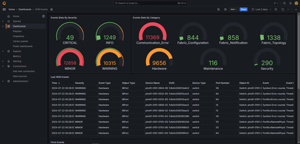

# UFM Events Grafana Dashboard Plugin

## Overview
This plugin monitors and parses UFM events from the `event.log` file using Fluentd. It pushes the logs to a Loki server and visualizes them through Grafana dashboards.

## Installation
1. **Install Plugin** on UFM.
2. **Access Grafana Dashboard** at: `http://<IP>:3002` (default credentials: `admin/admin`).

## Components
- **Fluentd**: Parses `event.log` file, extracts relevant fields, and pushes logs to Loki.
- **Loki**: Aggregates and stores logs.
- **Grafana**: Visualizes logs with predefined panels (e.g., Events Stats, Topology Changes, Hardware Events).

## Configuration Files
- Fluentd: `/opt/ufm/files/conf/plugins/ufm_events_grafana_dashboard/fluentd/fluentd.conf`
- Loki: `/opt/ufm/files/conf/plugins/ufm_events_grafana_dashboard/loki/loki-local-config.yaml`
- Grafana: `/opt/ufm/files/conf/plugins/ufm_events_grafana_dashboard/grafana/grafana.ini`

## Logs
Plugin logs are stored in `/opt/ufm/files/log/plugins/ufm_events_grafana_dashboard/`.

## Usage
Navigate to Grafana -> Dashboards -> UFM Events to view predefined panels or create custom queries under the Explore section.

