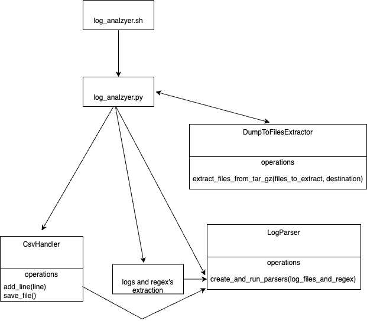

# UFM LOGANALYZER

**Warning:** This feature is still under development and should only be used internally

## What
This tool should help developers find issues in a UFM sysdump or logs.

It is meant to help find issues fast ,without the need to manually go over logs.

## How to use
The tool is meant to run from a PC or a remote connection

### Prerequisites
Install the needed Python dependencies
```
python3 -m pip install -r src/loganalyze/requirements.txt
```
Install software for PDF creation:
```
# For Ubuntu/Debian
sudo apt-get update
sudo apt-get install -y libjpeg-dev zlib1g-dev

# For Red Hat/CentOS/Fedora
sudo yum install -y libjpeg-devel zlib-devel
```
Know your UFM sysdump location.

### How to run
```
./log_analzer.sh  [options] -l <path to dump>
```

While the options are:
```
options:
  -h, --help            show this help message and exit
  -l LOCATION, --location LOCATION
                        Location of dump tar file.
  -d DESTINATION, --destination DESTINATION
                        Where should be place the extracted logs and the CSV files.
  --extract-level EXTRACT_LEVEL
                        Depth of logs tar extraction, default is 1
  --hours HOURS         How many hours to process from last logs. Default is 6 hours
  -i, --interactive     Should an interactive Ipython session start. Default is False
  --skip-tar-extract    If the location is to an existing extracted tar or just UFM logs directory, skip the tar extraction and only copy the needed logs. Default is False
  --interval [{1min,10min,1h,24h}]
                        Time interval for the graphs. Choices are: '1min'- Every minute, '10min'- Every ten minutes, '1h'- Every one hour, '24h'- Every 24 hours. Default is '1H'.
  ```

What is mandatory:
1. `--location`.

## Which files are taken from the dump
The following list: `event.log, ufmhealth.log, ufm.log, ibdiagnet2.log, console.log, rest_api.log, telemetry samples (taken from the second telemetry by the UFM) and ibdiagnet2_port_counters.log (for primary and secondary telemetry)`

Also, each log `tar` is taken, according to the `extract-level` flag.
## How it works
1. Given the list of logs to work with, they are extracted from the dump to the destination directory.
2. Each log is being parsed, with his own unique set of regex's.
3. Each parsed line is saved in a CSV file that represents the parsed line from the specific log.
4. Once all logs are parsed, we use Pandas analyzer to load the CSV's and query them.
5. A pre defined set of analysis runs and outputs some plots and data to the terminal.
6. A PDF file is created with the summary of the images and the fabric size.
7. We are starting an interactive Python session, where the user can run pre-defined analysis function on the parsed data, or do personal data query/manipulation to find the needed data

## Link flapping
This logic uses second telemetry counters to identify if links are flapping due to real issues.
The input is the telemetry sample from last week and last 5 minutes.
Output is a list of links to check.
This logic will show links that:
1. Both sides of the link went down together.
2. Thermal shut down.
3. If one side went down and the other side was not rebooted.



## Telemetry logs analysis
For each telemetry instance log (primary and secondary) we will:
1. Show how much time it took to collect the counters.
2. Show the fabric size over time (average).
3. Show the collectix version found in the logs.
4. Indicate about core dumps that might have caused a restart.

## Testing

There is a folder named `unit_tests`, this folder contains some unit tests, to run the tests follow these steps:

1. Inside the project virtual environment, make sure you have `pytest` installed.
  If not, you can install it using `pip`:
   ```bash
   python3 -m pip install pytest 
   ```
2. Navigate to the root directory of the log analyzer project:
    ```bash
    cd plugins/ufm_log_analyzer_plugin
    ```
3. Run `pytest` to execute the tests:
    ```bash
    pytest unit_tests
    ```


## Deployment

To create a deployment package for the UFM Log Analyzer Plugin, follow these steps:

1. Ensure you're working with the latest main branch and create a release branch:
   ```bash
   git switch main
   git pull origin main
   git switch -c release/vX.X.X-X
   ```

2. Ensure you're in the root directory of the log analyzer project:
   ```bash
   cd plugins/ufm_log_analyzer_plugin
   ```

3. Update the version in the VERSION file:
   ```bash
   echo "X.X.X-X" > VERSION
   git add VERSION
   git commit -m "Bump version to X.X.X-X"
   git push origin release/vX.X.X-X
   ```

4. Create a Pull Request from `release/vX.X.X-X` to `main` branch
   - Wait for PR approval and merge

5. After the PR is merged, switch to the updated main branch:
   ```bash
   git switch main
   git pull origin main
   ```

6. Create a new version tag in git:
   ```bash
   VERSION=$(cat VERSION)
   git tag -a ufm_log_analyzer_${VERSION} -m "UFM Log Analyzer version ${VERSION} release"
   git push origin ufm_log_analyzer_${VERSION}
   ```

7. Create the deployment package in /tmp:
   ```bash
   VERSION=$(cat VERSION)
   PACKAGE_NAME="ufm_log_analyzer_${VERSION}"
   
   # Clean up any previous attempts and python cache
   rm -rf /tmp/${PACKAGE_NAME}
   find . -type d -name "__pycache__" -exec rm -rf {} +
   find . -type d -name ".ruff_cache" -exec rm -rf {} +
   
   # Create directory and copy files
   mkdir -p /tmp/${PACKAGE_NAME}
   
   # Find and copy files while maintaining directory structure
   find . -type f \
       ! -path "./unit_tests/*" \
       ! -path "./.git/*" \
       ! -path "./.gitignore" \
       ! -path "./.ruff_cache/*" \
       ! -path "*/__pycache__/*" \
       -exec bash -c '
           mkdir -p /tmp/'${PACKAGE_NAME}'/$(dirname {})
           cp {} /tmp/'${PACKAGE_NAME}'/{}
       ' \;
   
   # Create the tar from the clean directory
   cd /tmp
   tar -czf ${PACKAGE_NAME}.tar.gz ${PACKAGE_NAME}
   
   # Clean up
   rm -rf /tmp/${PACKAGE_NAME}
   ```

8. Copy the package to the release directory:
   ```bash
   cp /tmp/ufm_log_analyzer_${VERSION}.tar.gz /mswg/release/ufm/plugins/log_analyzer/
   ```
