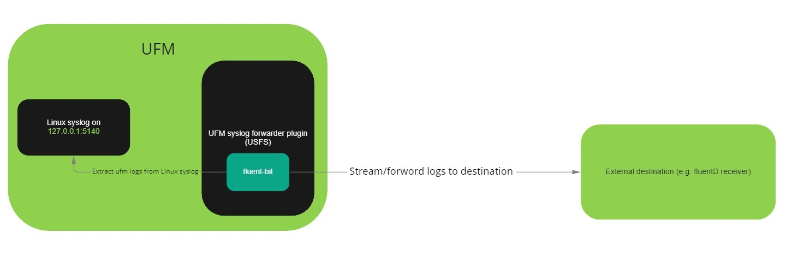

UFM syslog forwarder streaming (USFS)
--------------------------------------------------------


This plugin is used to forward and stream the UFM syslog to either a remote syslog server or/and to any external destination (E.g. [Fluentd endpoint](https://www.fluentd.org/)).

Overview
--------------------------------------------------------

The UFM Enterprise product is Nvidia’s platform for IB fabric management. Through this platform, the various devices (switches, multi-chip systems, cables, etc.) are discovered, configured and the status of the entire fabric is reflected. As a fabric manager, it will be useful to collect the UFM Enterprise events/logs, stream them to the destination endpoint and monitor it. In order to do so, we present UFM syslog stream to an external endpoint (USFS)



Plugin Deployment
--------------------------------------------------------

### To deploy the plugin on UFM-SDN Appliance:

- Login as admin
- Run 


    > enable
    
    > config terminal

- Make sure that UFM is running


    > show ufm status
- if UFM is down then run it

    > ufm start
  
- Make sure docker is running
  
    > no docker shutdown
  
- Load the latest plugin container
  - In case of HA, load the plugin on the standby node as well;
  - if your appliance is connected to the internet, you could simply run:
    > docker pull mellanox/ufm-plugin-usfs
  - if your appliance is not connected to the internet, you need to load the image offline 
    - Use a machine that is connected to the internet to save the docker image 
      > docker save mellanox/ufm-plugin-usfs:latest | gzip > ufm-plugin-usfs.tar.gz
    - Move the file to scp shared location that is accessible to the appliance 
    - Fetch the image to the appliance 
      > image fetch scp://user@hostname/path-to-file/ufm-plugin-usfs.tar.gz
    - Load the image
      > docker load ufm-plugin-usfs.tar.gz
- Enable & start the plugin 

    > ufm plugin usfs add
    
    
-	Check that plugin is up and running with

    > show ufm plugin


### To deploy the plugin on UFM Docker container:
  - Load the latest plugin container
      - In case of HA, load the plugin on the standby node as well;
      - if your machine is connected to the internet, you could simply run:
        > docker pull mellanox/ufm-plugin-usfs
      - if your server is not connected to the internet, you need to load the image offline 
        - Use a machine that is connected to the internet to save the docker image 
          > docker save mellanox/ufm-plugin-usfs:latest | gzip > ufm-plugin-usfs.tar.gz
        - Move the file to some shared location that is accessible to the UFM machine 
        - Load the image to UFM machine
          > docker load < /[some-shared-location]/ufm-plugin-usfs.tar.gz
        
- Enable & start the plugin
    > docker exec ufm /opt/ufm/scripts/manage_ufm_plugins.sh add -p usfs 


- Check that plugin is up and running with
    
    
    > docker exec ufm /opt/ufm/scripts/manage_ufm_plugins.sh show


### To deploy the plugin with UFM Enterprise (SA or HA):
- Install the latest version of UFM.
 
- Load the latest plugin container
  - In case of HA, load the plugin on the standby node as well;
  - if your machine is connected to the internet, you could simply run:
    > docker pull mellanox/ufm-plugin-usfs
  - if your appliance is not connected to the internet, you need to load the image offline 
    - Use a machine that is connected to the internet to save the docker image 
      > docker save mellanox/ufm-plugin-usfs:latest | gzip > ufm-plugin-usfs.tar.gz
    - Move the file to some shared location that is accessible to the UFM machine 
    - Load the image to UFM machine
      > docker load < /[some-shared-location]/ufm-plugin-usfs.tar.gz
      
- To enable & start the plugin, run :

    > /opt/ufm/scripts/manage_ufm_plugins.sh add -p usfs
  
- Check that plugin is up and running with
 
    >docker ps;

Log file usfs.log is located in /opt/ufm/files/log on the host.


Usage
--------------------------------------------------------
### 1.Configure the UFM syslog:
Enable the syslog on the UFM side using the following REST API:
   
METHOD: _PUT_
   
URL: _https://[HOST-IP]/ufmRest/app/syslog
   
Payload Example:
```json
{
   "active": true,
   "destination": "127.0.0.1:5140",
   "level":"<severity>",
   "ufm_log":true,
   "events_log":true
}
```

cURL Example:
```bash
curl -XPUT 'https://10.209.36.68/ufmRest/app/syslog' \
  -k \
  -u admin:123456 \
  -H 'content-type: application/json' \
  -d '{"active": true,"level": "WARNING","ufm_log": true,"events_log": true,"destination": "127.0.0.1:5140"}'
```

* _[severity]_ could be any of the following values: CRITICAL, ERROR, WARNING, INFO, or DEBUG.

### 2.Configure the destination endpoint:
You can forward the events to any external destination you want; we will show an example how to configure the fluentD as a destination:
- Pull the [Fluentd Docker](https://hub.docker.com/r/fluent/fluentd/) by running:
 
 
    > docker pull fluent/fluentd
    
- Run the Fluentd docker by running:

    
    > docker run -ti --rm --network host -v /tmp/fluentd:/fluentd/etc fluentd -c /fluentd/etc/fluentd.conf

* We provide [fluentd.conf](conf/fluentd.conf) as a fluentd configurations sample.

### 3.Set the plugin configurations by the following API:

   METHOD: _PUT_
   
   URL: _https://[HOST-IP]/ufmRest/plugin/usfs/conf_
   
   Payload Example:
   ```json
{
    "UFM-syslog-endpoint": {
        "host": "127.0.0.1",
        "port": 5140
    },
    "fluent-bit-endpoint": {
        "destination_host": "127.0.0.1",
        "destination_port": 24226,
        "enabled": true,
        "message_tag_name": "ufm_syslog",
        "source_port": 24227
    },
    "logs-config": {
        "log_file_backup_count": 5,
        "log_file_max_size": 10485760,
        "logs_file_name": "usfs.log",
        "logs_level": "INFO"
    },
    "streaming": {
        "enabled": false
    },
    "syslog-destination-endpoint": {
        "enabled": false,
        "host": "127.0.0.1",
        "port": 514
    }
}
   ```
cURL Example:
```bash
curl -XPUT 'https://10.209.36.68/ufmRest/plugin/usfs/conf/' \
 -k \
 -H 'Content-Type: application/json' \
 -d '{"streaming": {"enabled": true}, "syslog-destination-endpoint":{"enabled": true,"host": "10.209.36.67","port": 514}, {"fluent-bit-endpoint": {"enabled": true,"destination_host": "10.209.36.67","destination_port": 24225}}}'
```

   - Updating the configurations while the streaming is running will restart all the running streaming services automatically and the new changes will take effect immediately

      
 Configuration Parameters Details:
--------------------------------------------------------

|                                    Parameter                                    | Required |                                                                Description                                                                |
|:-------------------------------------------------------------------------------:|:--------:|:-----------------------------------------------------------------------------------------------------------------------------------------:|
|       [UFM-syslog-endpoint.host](conf/ufm_syslog_streaming_plugin.cfg#L2)       |   True   |                Hostname or IPv4 or IPv6 of the UFM syslog address, which is normally the localhost [Default is 127.0.0.1]                 |
|       [UFM-syslog-endpoint.port](conf/ufm_syslog_streaming_plugin.cfg#L3)       |   True   |                         Port the UFM syslog address [This port should be the port that is configured in step #1]                          |
|     [fluent-bit-endpoint.enabled](conf/ufm_syslog_streaming_plugin.cfg#L6)      |   True   | If True, the logs will be forwarded to the external destination address once the required configurations have been set [Default is False] |
|   [fluent-bit-endpoint.source_port](conf/ufm_syslog_streaming_plugin.cfg#L7)    |   True   |                                       Port of the syslog input of the fluent-bit [Default is 24227]                                       |
| [fluent-bit-endpoint.destination_host](conf/ufm_syslog_streaming_plugin.cfg#L8) |  False   |                                           Hostname or IPv4 or IPv6 of the destination endpoint                                            |
| [fluent-bit-endpoint.destination_port](conf/ufm_syslog_streaming_plugin.cfg#L9) |  False   | Port for destination endpoint [this port should be the port that is configured in [fluentd.conf](conf/fluentd.conf#L4), Default is 24225] |
| [fluent-bit-endpoint.message_tag_name](conf/ufm_syslog_streaming_plugin.cfg#10) |  False   |                                   Message Tag Name for Fluentbit collector [Default is the ufm_syslog]                                    |
| [syslog-destination-endpoint.enabled](conf/ufm_syslog_streaming_plugin.cfg#L13) |   True   |    If True, the logs will be forwarded to an external syslog server once the required configurations have been set [Default is False]     |
|  [syslog-destination-endpoint.host](conf/ufm_syslog_streaming_plugin.cfg#L14)   |  False   |                                  Hostname or IPv4 or IPv6 of the external syslog server address endpoint                                  |
|  [syslog-destination-endpoint.port](conf/ufm_syslog_streaming_plugin.cfg#L15)   |  False   |                                  Port of of the external syslog server address endpoint, Default is 514]                                  |
|          [streaming.enabled](conf/ufm_syslog_streaming_plugin.cfg#L18)          |   True   |                 If True, the streaming will be started once the required configurations have been set [Default is False]                  |
|     [logs-config.logs_file_name](conf/ufm_syslog_streaming_plugin.cfg#L21)      |   True   |                                                 Log file name [Default = '/log/usfs.log']                                                 |
|       [logs-config.logs_level](conf/ufm_syslog_streaming_plugin.cfg#L22)        |   True   |                                                             Default is 'INFO'                                                             |
|    [logs-config.max_log_file_size](conf/ufm_syslog_streaming_plugin.cfg#L23)    |   True   |                                             Maximum log file size in Bytes [Default is 10 MB]                                             |
|  [logs-config.log_file_backup_count](conf/ufm_syslog_streaming_plugin.cfg#L24)  |   True   |                                             Maximum number of backup log files [Default is 5]                                             |

### 4.Get the plugin configurations by the following API:

   METHOD: _GET_
   
   URL: _https://[HOST-IP]/ufmRest/plugin/usfs/conf_

