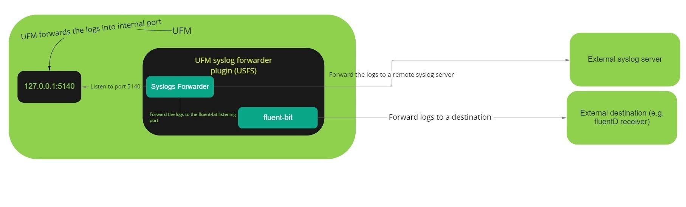

UFM syslog stream to an external endpoint (USFS)
--------------------------------------------------------


This plugin is used to stream the UFM events via FluentBit forwarder to any external destination (E.g. [Fluentd endpoint](https://www.fluentd.org/)).

Overview
--------------------------------------------------------

The UFM Enterprise product is Nvidia’s platform for IB fabric management. Through this platform, the various devices (switches, multi-chip systems, cables, etc.) are discovered, configured and the status of the entire fabric is reflected. As a fabric manager, it will be useful to collect the UFM Enterprise events/logs, stream them to the destination endpoint and monitor it. In order to do so, we present UFM syslog stream to an external endpoint (USFS)



Plugin Deployment
--------------------------------------------------------

### To deploy the plugin on UFM-SDN Appliance:

- Login as admin
- Run 


    > enable
    
    > config terminal

- Make sure that UFM is running


    > show ufm status
- if UFM is down then run it

    > ufm start
  
- Make sure docker is running
  
    > no docker shutdown
  
- Load the latest plugin container
  - In case of HA, load the plugin on the standby node as well;
  - if your appliance is connected to the internet, you could simply run:
    > docker pull mellanox/ufm-plugin-usfs
  - if your appliance is not connected to the internet, you need to load the image offline 
    - Use a machine that is connected to the internet to save the docker image 
      > docker save mellanox/ufm-plugin-usfs:latest | gzip > ufm-plugin-usfs.tar.gz
    - Move the file to scp shared location that is accessible to the appliance 
    - Fetch the image to the appliance 
      > image fetch scp://user@hostname/path-to-file/ufm-plugin-usfs.tar.gz
    - Load the image
      > docker load ufm-plugin-usfs.tar.gz
- Enable & start the plugin 

    > ufm plugin usfs add
    
    
-	Check that plugin is up and running with

    > show ufm plugin


### To deploy the plugin on UFM Docker container:
  - Load the latest plugin container
      - In case of HA, load the plugin on the standby node as well;
      - if your machine is connected to the internet, you could simply run:
        > docker pull mellanox/ufm-plugin-usfs
      - if your server is not connected to the internet, you need to load the image offline 
        - Use a machine that is connected to the internet to save the docker image 
          > docker save mellanox/ufm-plugin-usfs:latest | gzip > ufm-plugin-usfs.tar.gz
        - Move the file to some shared location that is accessible to the UFM machine 
        - Load the image to UFM machine
          > docker load < /[some-shared-location]/ufm-plugin-usfs.tar.gz
        
- Enable & start the plugin
    > docker exec ufm /opt/ufm/scripts/manage_ufm_plugins.sh add -p usfs 


- Check that plugin is up and running with
    
    
    > docker exec ufm /opt/ufm/scripts/manage_ufm_plugins.sh show


### To deploy the plugin with UFM Enterprise (SA or HA):
- Install the latest version of UFM.
 
- Load the latest plugin container
  - In case of HA, load the plugin on the standby node as well;
  - if your machine is connected to the internet, you could simply run:
    > docker pull mellanox/ufm-plugin-usfs
  - if your appliance is not connected to the internet, you need to load the image offline 
    - Use a machine that is connected to the internet to save the docker image 
      > docker save mellanox/ufm-plugin-usfs:latest | gzip > ufm-plugin-usfs.tar.gz
    - Move the file to some shared location that is accessible to the UFM machine 
    - Load the image to UFM machine
      > docker load < /[some-shared-location]/ufm-plugin-usfs.tar.gz
      
- To enable & start the plugin, run :

    > /opt/ufm/scripts/manage_ufm_plugins.sh add -p usfs
  
- Check that plugin is up and running with
 
    >docker ps;

Log file usfs.log is located in /opt/ufm/files/log on the host.


Usage
--------------------------------------------------------
### 1.Configure the UFM syslog:
Configure UFM to send events via syslog to the FluentBit event forwarder in the main UFM configurations file that locates under /opt/ufm/files/conf/gv.cfg:

>[Logging]
syslog_addr=127.0.0.1:5140
syslog = true
ufm_syslog = true
event_syslog = true
syslog_level = <severity>

* <severity> may be set to any of the following values: CRITICAL, ERROR, WARNING, INFO, or DEBUG.

### 2.Configure the destination endpoint:
You can forward the events to any external destination you want; we will show an example how to configure the fluentD as a destination:
- Pull the [Fluentd Docker](https://hub.docker.com/r/fluent/fluentd/) by running:
 
 
    > docker pull fluent/fluentd
    
- Run the Fluentd docker by running:

    
    > docker run -ti --rm --network host -v /tmp/fluentd:/fluentd/etc fluentd -c /fluentd/etc/fluentd.conf

* We provide [fluentd.conf](conf/fluentd.conf) as a fluentd configurations sample.

### 3.Set the plugin configurations by the following API:

   METHOD: _POST_
   
   URL: _https://[HOST-IP]/ufmRest/plugin/usfs/conf_
   
   Payload Example:
   ```json
{
  "destination-endpoint": {
    "host": "localhost",
    "port": 24225
  },
  "streaming": {
    "enabled": true,
    "message_tag_name": "ufm_syslog"
  },
  "logs-config": {
    "log_file_backup_count": 5,
    "log_file_max_size": 10485760,
    "logs_file_name": "/log/usfs.log",
    "logs_level": "INFO"
  }
}
   ```

   - Updating the configurations while the streaming is running will restart the fluent-bit collector service automatically and the new changes will take effect immediately

      
 Configuration Parameters Details:
--------------------------------------------------------

| Parameter | Required | Description |
| :---: | :---: |:---: |
| [destination-endpoint.host](conf/ufm_syslog_streaming_plugin.cfg#L2) | True |  Hostname or IPv4 or IPv6 for destination endpoint
| [destination-endpoint.port](conf/ufm_syslog_streaming_plugin.cfg#L3) | True | Port for destination endpoint [this port should be the port that is configured in [fluentd.conf](conf/fluentd.conf#L4)]
| [streaming.enabled](conf/ufm_syslog_streaming_plugin.cfg#L6) | True | If True, the streaming will be started once the required configurations have been set [Default is False]
| [streaming.message_tag_name](conf/ufm_syslog_streaming_plugin.cfg#7) | False | Message Tag Name for Fluentbit collector [Default is the ufm_syslog]
| [logs-config.logs_file_name](conf/ufm_syslog_streaming_plugin.cfg#L10) | True | Log file name [Default = '/log/usfs.log']
| [logs-config.logs_level](conf/ufm_syslog_streaming_plugin.cfg#L11) | True | Default is 'INFO'
| [logs-config.max_log_file_size](conf/ufm_syslog_streaming_plugin.cfg#L12) | True | Maximum log file size in Bytes [Default is 10 MB]
| [logs-config.log_file_backup_count](conf/ufm_syslog_streaming_plugin.cfg#L13) | True | Maximum number of backup log files [Default is 5]

   
### 4.Get the plugin configurations by the following API:

   METHOD: _GET_
   
   URL: _https://[HOST-IP]/ufmRest/plugin/usfs/conf_

