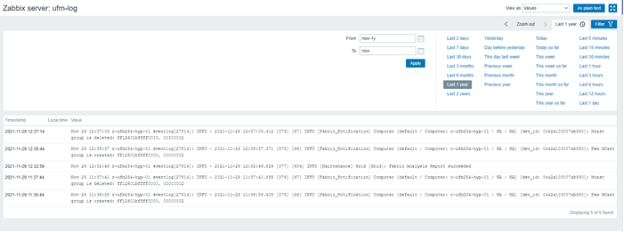

Zabbix
--------------------------------------------------------

This is to explain how to stream UFM events to [Zabbix](https://www.zabbix.com/)

Prerequisites
--------------------------------------------------------

To install Zabbix on your machine, please follow the [online manual](https://www.zabbix.com/documentation/current/en/manual) .

Zabbix Agent Configuration
--------------------------------------------------------
a) Install Zabbix agent on the node you would like to monitor:

    # rpm -Uvh https://repo.zabbix.com/zabbix/5.4/rhel/7/x86_64/zabbix-release-5.4-1.el7.noarch.rpm
    # yum clean all
    # yum install zabbix-agent

b) Configure the agent

    vim /etc/zabbix/zabbix_agentd.conf

    Server=[zabbix server ip]
    ServerActive=[zabbix server ip]
    Hostname=[the host name that is created on zabbix server]

c) Start zabbix agent

    sudo systemctl restart zabbix-agent 
    sudo systemctl enable zabbix-agent

Creating a host in Zabbix Server frontend:
--------------------------------------------------------
1) Go to: Configuration → Hosts.
2) Click on Create host in the upper corner of the screen.

Host name

Enter the remote host name as configured in the agent configuration file.

Groups

Select one or several existing groups by clicking Select button or enter a non-existing group name to create a new group.

IP address

Enter the IP address of the remote host.

Creating a log item in Zabbix Server frontend:
--------------------------------------------------------
1) Go to: Configuration → Hosts.
2) Click on your host name.
3) Click on Items in the row of the host.
4) Click on Create item in the upper corner of the screen.
5) Enter parameters of the item in the form.
6) Click on Add

 Viewing UFM Events
--------------------------------------------------------

To view the latest events retrieved by the log item, do the following:

1) Go to: Monitoring → Latest Data.
2) Type the log item name in the Name field then click Apply
3) Click History from the right of the item

