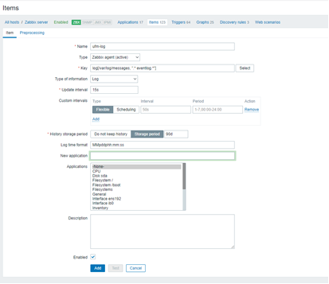

Zabbix
--------------------------------------------------------

This is to explain how to stream UFM events to [Zabbix](https://www.zabbix.com/)

Prerequisites
--------------------------------------------------------

To install Zabbix on your machine, please follow the [online manual](https://www.zabbix.com/documentation/current/en/manual) .

Zabbix configuration
--------------------------------------------------------

Create a log item in Zabbix frontend:

1) Go to: Configuration → Hosts.
2) Click on Items in the row of the host.
3) Click on Create item in the upper corner of the screen.
4) Enter parameters of the item in the form.
5) Click on Add

 Viewing UFM Events
--------------------------------------------------------

To view the latest events retrieved by the log item, do the following:

1) Go to: Monitoring → Latest Data.
2) Type the log item name in the Name field then click Apply
3) Click History from the right of the item

